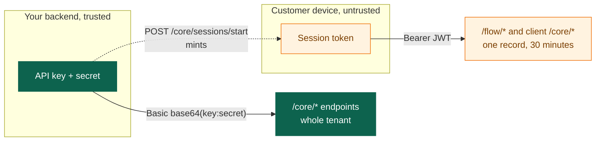

# Authentication

Two credentials with deliberately different reach. Getting this boundary right
is the single most important decision in the integration.



## API key

Your tenant credential. Backend only.

```http
Authorization: Basic <base64(key:secret)>
```

Standard HTTP Basic: join the key and secret with a colon, base64 the result.

=== "bash"

    ```bash
    AUTH=$(printf '%s:%s' "$API_KEY" "$API_SECRET" | base64)
    curl -H "Authorization: Basic $AUTH" ...
    ```

=== "C#"

    ```csharp
    var creds = Convert.ToBase64String(
        Encoding.UTF8.GetBytes($"{apiKey}:{apiSecret}"));
    http.DefaultRequestHeaders.Authorization = new("Basic", creds);
    ```

=== "Node"

    ```javascript
    const creds = Buffer
      .from(`${apiKey}:${apiSecret}`)
      .toString("base64");
    headers.Authorization = `Basic ${creds}`;
    ```

=== "PHP"

    ```php
    $creds = base64_encode("{$apiKey}:{$apiSecret}");
    $headers['Authorization'] = "Basic {$creds}";
    ```

=== "Python"

    ```python
    import base64
    creds = base64.b64encode(
        f"{api_key}:{api_secret}".encode()
    ).decode()
    headers = {"Authorization": f"Basic {creds}"}
    ```

!!! tip "We may hand you the encoded string directly"
    Some onboarding packs contain the finished base64 value rather than the two
    parts. If what you were given already looks like base64, use it as-is after
    `Basic ` and do not encode it twice.

An API key authenticates as your whole tenant. It can start sessions for any
`uid`, read any record's checks, and push data. Treat it like a database
password: server-side only, in a secret manager, rotated when someone leaves.

### Endpoints that take it

| | Path |
|-|------|
| <span class="ek-m post">POST</span> | `/core/sessions/start` |
| <span class="ek-m post">POST</span> | `/core/store` |
| <span class="ek-m post">POST</span> | `/core/documents/store-update` |
| <span class="ek-m post">POST</span> | `/core/records/{id}/international-transactions/access` |
| <span class="ek-m get">GET</span> | `/core/settings` |

## Session token

A JWT bound to one record, issued by `POST /core/sessions/start` and valid for
30 minutes.

```http
Authorization: Bearer <jwt>
```

The claims carry the tenant, the record and the session. Every `/flow/*`
endpoint reads the record from the token rather than from the request, which is
why none of them take a record id. There is no id in the request to tamper
with.

### Endpoints that take it

Everything under `/flow/*`, plus the client-facing `/core/*` operations:
document submission and data, NFC, liveness, attempts, session completion,
`GET /core/records/{id}/checks`, and `GET /core/settings`.

!!! note "Record checks need a session token, not an API key"
    `GET /core/records/{id}/checks` is the one read-only endpoint a backend
    might expect to reach with its API key, and it does not. To read it
    server-side, call `POST /core/sessions/start` for that `uid` and use the
    token it returns.

    That costs a `SessionCreated` webhook each time, so treat it as a
    diagnostic path rather than something to run on a schedule.

### Expiry and renewal

Thirty minutes from issue. `expires_at` comes back with the token.

Two ways to get a fresh one:

1. Call `POST /core/sessions/start` again from your backend with the same
   `uid`. It resolves to the same record when one exists.
2. Call `POST /core/records/attempts`. When it creates a new attempt on a
   terminal record, the response carries a newly issued token, and the client
   must switch to it for every subsequent call.

There is no refresh endpoint. Thirty minutes comfortably covers a verification
flow, and a customer who leaves mid-flow and comes back should get a fresh
session from your backend.

## The rule that matters

!!! danger "The API key never ships to a device"
    Mobile binaries can be unpacked. A key in an app is a key in the hands of
    anyone who wants it, and it authenticates as your entire tenant.

    Your backend calls `POST /core/sessions/start` and hands the app the
    *session token*: one record, thirty minutes, nothing else.

    The SDK's `KycSession.withSecret()` does put the secret in the app. That
    exists so a demo works before your backend does. Do not ship it.

## Unauthenticated endpoints

One: `POST /flow/change-request/verify`. It takes a change-request secret that
we generated and you delivered to the customer, and it exchanges that secret
for a scoped session token. The secret is the credential.

## Failure modes

| Response | Cause |
|----------|-------|
| `401` on an API-key call | Header missing, not prefixed `Basic `, not valid base64, or the key or secret is wrong. |
| `401` on a session call | Token expired, malformed, or signed for a different environment. |
| `404` on a valid-looking id | The resource exists but belongs to another tenant. We do not distinguish, on purpose. |

Tenant scoping is enforced in the data layer, so a cross-tenant read returns
"not found" rather than "not yours". That is deliberate: the second answer
leaks that the id is real.

---

Next: [Sessions and attempts](sessions.md).
