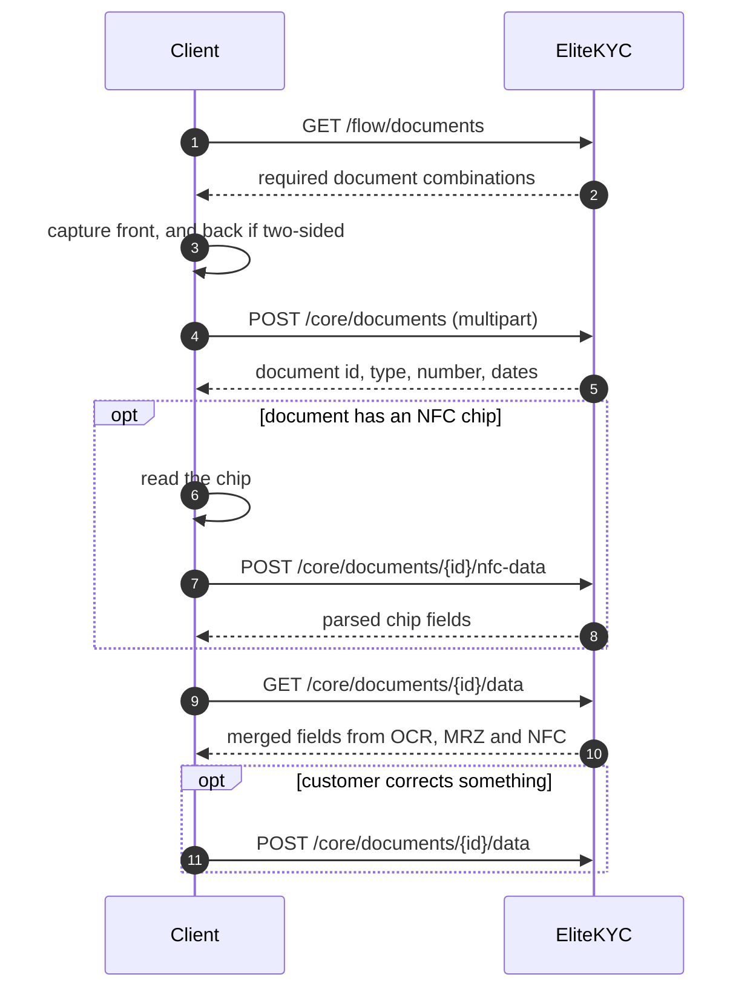

# Documents

Capture, upload, chip reading, and the extracted data. Session token
throughout.

## The document flow



Upload first, then enrich. Every later call is keyed by the document id the
upload returned.

---

## Submit a document

<span class="ek-m post">POST</span> <span class="ek-path">/core/documents</span> <span class="ek-auth">session</span>

`multipart/form-data`.

| Part | Type | Required |
|------|------|:--------:|
| `Key` | text | yes |
| `front_side` | file | yes |
| `back_side` | file | only for two-sided documents |

`Key` is the document type key from the `type` field of
[`GET /flow/documents`](flow.md#documents-schema), for example
`IQ_NATIONAL_CARD`.

!!! note "`Key` is capitalised, the file parts are not"
    The two file parts bind from explicit snake_case names, `front_side` and
    `back_side`. The type key binds from the property name, which is `Key`.
    That inconsistency is real, and it is what the SDK sends.

### Response `200`

```json
{
  "document": {
    "id": "01H1W1DF8K2M3N4P5Q6R7S8T9V",
    "document_type_id": "01H1W1DG9L3N4P5Q6R7S8T9V0W",
    "document_type_key": "IQ_NATIONAL_CARD",
    "document_number": "AC398204",
    "issue_date": "2020-01-01",
    "expire_date": "2030-01-01",
    "mrz": "IDIRQ..."
  }
}
```

OCR and MRZ parsing run during the request, which is why the response already
knows the document number and dates. Authenticity checks run later in the
background.

### Response `400`

| Code | Meaning |
|------|---------|
| `DocumentManagement.MissingBackImage` | Two-sided type, only one side sent. |
| `DocumentManagement.NoFaceDetected` | This type must carry a portrait and none was found. |
| `DocumentManagement.MissingMrz` | This type must carry a readable MRZ and none was found. |
| `DocumentManagement.DocumentUsedOnAnotherRecord` | This document already belongs to a different KYC application. |
| `DocumentManagement.DocumentInspectionUnavailable` | Inspection failed. Retry. |
| `DocumentManagement.DocumentTypeNotFound` | Unknown `key`. |
| `DocumentManagement.DuplicateDocumentTypeFound` | This type was already submitted on this record. |

`DocumentUsedOnAnotherRecord` is a fraud signal, not a user error. Someone is
presenting an identity document already tied to another customer. Do not offer
a cheerful retry.

### Example

```bash
curl -X POST https://ekyc.demo.elitesoft.iq/api/core/documents \
  -H "Authorization: Bearer $SESSION_TOKEN" \
  -F "Key=IQ_NATIONAL_CARD" \
  -F "front_side=@front.jpg" \
  -F "back_side=@back.jpg"
```

### Image quality

The server accepts what you send. Whether the *checks* accept it is a separate
question, and a blurry or glared photo is how a record ends up in manual review.

If you are building your own capture UI, reject bad frames before upload rather
than after. The SDK does this with tunable blur, glare and luminance
thresholds, and reproducing that behaviour is one of the larger pieces of work
in an API-driven integration. See
[scanner tuning](../sdk/customization.md#tuning-the-scanner) for the thresholds
we use.

---

## Update a document

<span class="ek-m post">POST</span> <span class="ek-path">/core/documents/update</span> <span class="ek-auth">session</span>

Replaces a document. Same multipart shape as submission.

!!! note "This creates a new document, it does not edit one"
    The previous document is retained and marked replaced, so the audit trail
    keeps both. The response carries the new document's id.

    If anything about the document's status changed, the record moves to
    `ManualReview`, because a replaced document is a thing a human should see.

### Response `200`

Same shape as [submission](#submit-a-document).

---

## Read extracted data

<span class="ek-m get">GET</span> <span class="ek-path">/core/documents/{id}/data</span> <span class="ek-auth">session</span>

Every field extracted for a document, merged across sources.

### Response `200`

```json
{
  "fields": {
    "mrz": "MRZ123456789",
    "gender": 1,
    "surname": "Doe",
    "first_name": "John",
    "father_name": "Robert Doe",
    "mother_name": "Jane Smith",
    "grandfather_name": "Edward Doe",
    "mother_father_name": "William Smith",
    "national_id": "9876543210",
    "family_number": "FAM123456",
    "date_of_birth": "1990-05-15",
    "place_of_birth": "Baghdad",
    "blood_category": "O+",
    "document_number": "DOC20231234",
    "issue_date": "2020-01-01",
    "expire_date": "2030-01-01",
    "issue_authority": "Gov Authority"
  },
  "selfie_photo": "https://storage.example.com/...?X-Amz-Algorithm=...",
  "nfc_extracted_at": "2026-08-26T10:05:00Z"
}
```

| Field | Meaning |
|-------|---------|
| `fields` | Every extracted field, merged across sources. |
| `selfie_photo` | Presigned URL for the portrait. Short-lived. |
| `nfc_extracted_at` | When chip data was read, or null if it never was. |

Which keys appear inside `fields` depends on the document type and on what was
readable. Do not assume any particular one exists.

`gender` is an integer, not a string.

!!! info "`selfie_photo` is a presigned URL and it expires"
    Use it immediately, do not persist it, and fetch a fresh one if you need
    the image again later. A stored URL becomes a broken image, not a security
    hole, which is the point of presigning.

`nfc_extracted_at` being non-null tells you the chip was read, which is the
quickest way to know how much to trust what is in `fields`.

Data can come from OCR, MRZ, NFC or the customer. The four sources are merged
into one view here. When the same field is available from more than one, the
more trustworthy source wins: chip data over MRZ, MRZ over OCR.

---

## Submit customer-entered data

<span class="ek-m post">POST</span> <span class="ek-path">/core/documents/{id}/data</span> <span class="ek-auth">session</span>

Fields the customer typed or corrected, stored alongside the machine-read ones
rather than overwriting them.

```json
{
  "fields": {
    "first_name": "Steve"
  }
}
```

**`201`** on success, with no body.

Both values survive: what OCR read and what the customer typed. A reviewer sees
the disagreement, which is the point. A customer quietly correcting a national
ID number is exactly what a reviewer needs to know about.

Which fields are accepted depends on the document type.

---

## Submit NFC chip data

<span class="ek-m post">POST</span> <span class="ek-path">/core/documents/{id}/nfc-data</span> <span class="ek-auth">session</span>

Encrypted data groups read from the document's chip. The client reads them, the
server parses them.

```json
{
  "nfc_data_groups": {
    "DG11": "6b7b5c085f0e5f0f5f105f115f0e26...",
    "DG12": "6c535c045f195f265f193f...",
    "DG13": "6d8203825c02df01df01820379e2808f..."
  },
  "nfc_photo": "base64EncodedPhotoString"
}
```

`nfc_photo` is optional.

| Data group | Contents |
|:----------:|----------|
| `DG1` | The MRZ |
| `DG2` | Facial image |
| `DG3` | Fingerprints, where present |
| `DG11` | Extended personal details |
| `DG12` | Extended document details |
| `DG13` | Issuer-specific data |
| `DG14` | Security options for chip authentication |

Send groups as hex strings, exactly as read. Do not parse them yourself.

### Response `200`

```json
{
  "fields": {
    "document_number": "DOC123456789",
    "date_of_birth": "1990-05-15",
    "expire_date": "2030-01-01",
    "national_id": "9876543210",
    "place_of_birth": "Baghdad",
    "gender": 1,
    "nationality": "IRQ"
  }
}
```

### Response `400`

`DocumentManagement.DocumentTypeDoesNotSupportNfc` when the document type has
no chip.

!!! tip "Read the chip whenever you can"
    Chip data is signed by the issuing authority. OCR is characters recognised
    from a photograph. When both are available they are not equally
    trustworthy, and a document read over NFC is materially harder to fake than
    one photographed.

    Chip support today: Iraqi national card, Iraqi passport, and international
    passports through the general handler. NFC is Android and iOS only.

---

Next: [Liveness](liveness.md).
