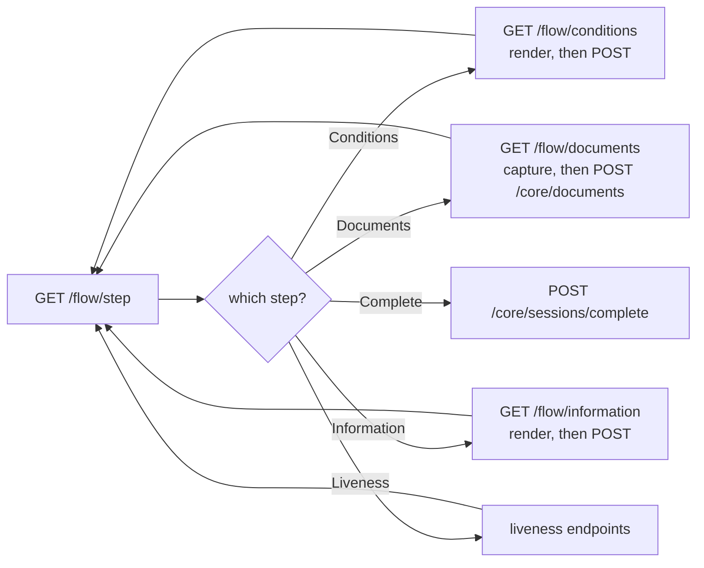

# Flow and schemas

The customer-facing journey. Session token on everything except change-request
verification.

These endpoints exist so you can render the flow yourself. If you use the SDK,
it calls all of them and you never touch this page.

## The loop

There is one pattern, and every step follows it.



Ask where you are, fetch that step's schema, render it, submit, ask again. The
server owns the ordering, so you never have to work out what comes next.

---

## Get the current step

<span class="ek-m get">GET</span> <span class="ek-path">/flow/step</span> <span class="ek-auth">session</span>

Where the customer has reached.

### Response `200`

```json
{
  "current": 5,
  "metadata": {}
}
```

| Value | Step |
|:-----:|------|
| `1` | Welcome |
| `2` | Conditions |
| `3` | Documents |
| `4` | Information |
| `5` | Liveness |
| `6` | Complete |

`metadata` carries step-specific context and its shape depends on the step. On
Documents after a step back it holds the current active document, so the client
can offer a replace rather than an add.

Submitting a step out of order returns `Kyc.StepPrerequisiteNotMet`. Read the
step rather than tracking position on the client.

---

## Step back

<span class="ek-m post">POST</span> <span class="ek-path">/flow/step/previous</span> <span class="ek-auth">session</span>

Moves back one step. No request body.

Returning from Information to Documents keeps the active document metadata, so
the customer can re-upload and replace a document they got wrong rather than
starting the step over.

### Response `200`

Same shape as [`GET /flow/step`](#get-the-current-step).

### Response `400`

`Kyc.StepBackNotAllowed` when the tenant has `allow_step_back` off. Check that
flag from [tenant settings](sessions.md#tenant-settings) and hide the back
button rather than showing one that errors.

---

## Conditions

The short form whose answers decide which documents are required.

### Get the schema

<span class="ek-m get">GET</span> <span class="ek-path">/flow/conditions</span> <span class="ek-auth">session</span>

```json
{
  "schema": {
    "fields": [
      {
        "name": "WhoAreYouRegisteringAs",
        "type": 5,
        "label": { "en": "I am registering as", "ar": "أسجل بصفتي", "ku": "..." },
        "options": [
          { "value": "Citizen", "title": { "en": "Citizen" } },
          { "value": "Resident", "title": { "en": "Resident" } }
        ],
        "validation": { "required": true }
      }
    ]
  }
}
```

Conditions are a flat list of fields under `schema.fields`, with no sections.
Information forms do have sections. Which fields exist is tenant-defined. See
[dynamic form schemas](#dynamic-form-schemas) for the properties you have to
handle.

### Submit answers

<span class="ek-m post">POST</span> <span class="ek-path">/flow/conditions</span> <span class="ek-auth">session</span>

```json
{
  "conditions": {
    "WhoAreYouRegisteringAs": "Citizen"
  }
}
```

Answers are wrapped in a `conditions` object and keyed by the field `name` from
the schema.

!!! warning "Option values are case-sensitive"
    `"Citizen"` and `"citizen"` are different. Send back exactly what the
    schema's `value` said, never the label you rendered.

**`204`** on success. **`400`** on a business error.

---

## Documents schema

<span class="ek-m get">GET</span> <span class="ek-path">/flow/documents</span> <span class="ek-auth">session</span>

Which documents the customer must submit, given the conditions they answered.

```json
{
  "documents": [
    {
      "type": "IQ_NATIONAL_CARD",
      "uploaded": false,
      "allow_full_screen_camera": false,
      "allow_gallery": false,
      "data": null
    }
  ]
}
```

| Field | Meaning |
|-------|---------|
| `type` | The document type key to send as `Key` when [submitting](documents.md#submit-a-document). |
| `uploaded` | Whether this document has already been captured on this record. |
| `allow_full_screen_camera` | Whether manual full-screen capture is offered alongside guided capture. |
| `allow_gallery` | Whether picking an existing photo is allowed. |
| `data` | Extracted data, once the document has been submitted. |
| `comment`, `rejection_reason` | Present only on rejected documents during a document update. |

!!! note "This payload is tenant-shaped"
    The server returns it as free-form JSON objects rather than a fixed
    contract, and what a tenant's configuration produces can include grouped
    alternatives, where the customer satisfies one group by providing every
    document in it. That is how "a national card, or a passport and a visa
    together" is expressed as configuration instead of a special case in your
    code.

    Read the payload, do not assume a shape. If you are building your own UI
    against this endpoint, get a sample from your own tenant before you write
    the parser.

Capture and upload: [Documents](documents.md).

---

## Information

The dynamic form for everything the documents did not answer.

### Get the schema

<span class="ek-m get">GET</span> <span class="ek-path">/flow/information</span> <span class="ek-auth">session</span>

```json
{
  "schema": {
    "sections": [
      {
        "title": { "en": "Contact details", "ar": "بيانات الاتصال" },
        "description": { "en": "How we reach you" },
        "fields": [
          {
            "name": "phone_number",
            "type": 1,
            "label": { "en": "Mobile number" },
            "placeholder": { "en": "07XX XXX XXXX" },
            "validation": { "required": true }
          }
        ]
      }
    ]
  }
}
```

Fields mapped to document fields arrive prefilled, so the customer confirms
rather than retypes.

### Submit answers

<span class="ek-m post">POST</span> <span class="ek-path">/flow/information</span> <span class="ek-auth">session</span>

Answers wrapped in an `information` object and keyed by field `name`.

```json
{
  "information": {
    "phone_number": "07701234567"
  }
}
```

**`204`** on success.

---

## Verify a document change request

<span class="ek-m post">POST</span> <span class="ek-path">/flow/change-request/verify</span> <span class="ek-auth">no auth</span>

Exchanges a change-request secret for a scoped session. This is how a customer
whose documents were rejected gets back in without redoing the whole flow.

### Request

```json
{
  "secret": "3f9a2b1c8d7e6f5a4b3c2d1e0f9a8b7c"
}
```

The secret reaches you in the
[`RecordPendingUserUpdate`](webhooks.md#recordpendinguserupdate) webhook, or
from
[international transaction access](records.md#request-international-transaction-access).
You deliver it to the customer, typically as a deep link.

### Response `200`

```json
{
  "record": {
    "id": "01H1W1DE6X9Z5YEP5Y8DHR3H7J",
    "info": [
      {
        "comment": "Photo is unreadable",
        "document_type_id": "01H1W1DF8K2M3N4P5Q6R7S8T9V",
        "rejection_reason_id": "01H1W1DG9L3N4P5Q6R7S8T9V0W"
      }
    ]
  },
  "session": {
    "id": "01H1W1DG9L3N4P5Q6R7S8T9V0W",
    "token": "eyJhbGciOiJIUzI1NiIs...",
    "expires_at": "2026-08-26T12:30:00Z"
  }
}
```

The token is scoped to this change request. `record.info` lists exactly what
needs resubmitting, with the reviewer's comment on each.

### Response `400`

`DocumentManagement.DocumentResubmission.InvalidSecret` when the secret is
wrong or expired.

The secret is the credential here, so treat it like one. Deliver it over a
channel you control, and expect it to be single-purpose and time-limited.

---

## Dynamic form schemas

Conditions and information are both rendered from schemas your compliance team
builds. Rendering one generically is most of the work in an API-driven
integration, and it is the main reason most teams use the SDK.

### Field types

`type` arrives as an integer.

| Value | Type | Renders as |
|:-----:|------|-----------|
| `1` | String | Single-line text |
| `2` | Number | Numeric input |
| `3` | Textarea | Multi-line text |
| `4` | Date | Date picker |
| `5` | Select | Dropdown from `options` |
| `6` | Checkbox | Boolean |
| `7` | Header | Section heading, not an input |
| `8` | Paragraph | Explanatory text, not an input |
| `9` | Signature | Signature pad |
| `11` | Repeater | Repeating group, its rows defined by nested `fields` |

!!! warning "Handle values you do not recognise"
    The back-office builder offers more field types than this table, and more
    get added. Treat an unknown `type` as a plain text input rather than
    throwing. The SDK maps anything unrecognised to a single `unknown` case and
    keeps going, and your renderer should do the same.

### Common properties

| Property | Meaning |
|----------|---------|
| `name` | The key you submit under. Stable. |
| `type` | Integer from the table above. |
| `label` | Localised label. An object keyed `en`, `ar`, `ku`, plus `-` as the fallback. |
| `placeholder` | Localised placeholder, same shape as `label`. |
| `text` | Localised body text, for headers and paragraphs. |
| `default` | Fallback value when nothing prefills it. |
| `read_only` | Display only. Submit the value unchanged. |
| `multiple` | Whether a select accepts more than one value. |
| `options` | For selects: `value` plus a localised `title`. |
| `validation` | Required, length and range bounds, patterns. |
| `fields` | Nested fields, for repeaters. |

### Localised strings

Any user-facing string is an object rather than a bare string:

```json
{ "en": "Mobile number", "ar": "رقم الهاتف", "ku": "ژمارەی مۆبایل", "-": "Mobile number" }
```

Resolve in this order: the requested language, then `-`, then `en`. A key can
be absent or empty, so falling through is not optional.

### Visibility rules

A field can be configured to appear only when an earlier answer makes it
relevant. Evaluate on every change to the form's values, not once at render.

A field hidden by its rules should not be submitted, and should not be
validated as required.

---

Next: [Documents](documents.md).
