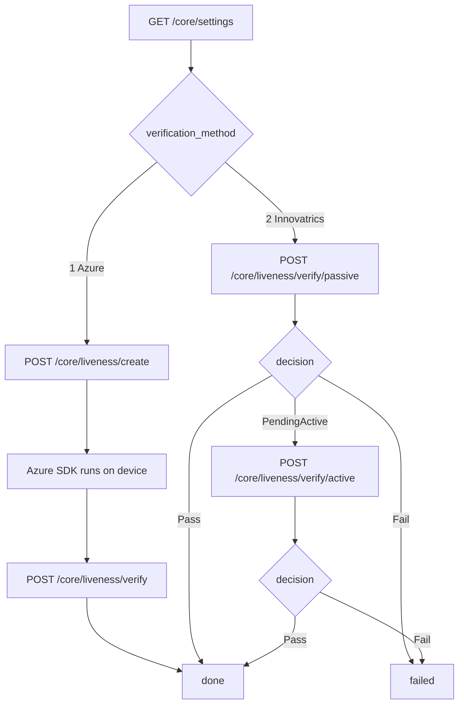

# Liveness

Proving the face in front of the camera belongs to a person who is physically
there, right now. Two providers, and your tenant is set to one of them.

!!! danger "Read the provider from settings. Never hardcode it."
    `GET /core/settings` returns `verification_method`: `1` for Azure, `2` for
    Innovatrics. The two use **entirely different endpoints**, and calling the
    wrong family returns a `400`.

    Getting this from settings is what lets us switch a tenant's provider
    without you shipping an app.



---

## Azure Face

Two calls with the Azure SDK's work in between.

### Create a session

<span class="ek-m post">POST</span> <span class="ek-path">/core/liveness/create</span> <span class="ek-auth">session</span>

Creates a one-time Azure liveness session. No request body.

#### Response `200`

```json
{
  "session": {
    "id": "8f14e45f-ceea-467a-9f47-8c2d3f1a5b6c",
    "token": "<liveness-session-token>"
  }
}
```

Hand both to the Azure Face Liveness SDK on the device.

#### Response `400`

The tenant has no face liveness check configured, or the tenant is on
Innovatrics and should be calling
[`/core/liveness/verify/passive`](#innovatrics) instead.

### Confirm completion

<span class="ek-m post">POST</span> <span class="ek-path">/core/liveness/verify</span> <span class="ek-auth">session</span>

Call once the Azure SDK reports it finished. No request body.

**`204`** on success. **`400`** on a business error.

| Code | Meaning |
|------|---------|
| `AutoChecks.LivenessCheck.SessionNotFound` | No liveness session for this record. Create one first. |
| `AutoChecks.LivenessCheck.OperationNotStarted` | The SDK never ran. |
| `AutoChecks.LivenessCheck.ResultsNotAvailable` | The SDK has not finished. Wait for its completion callback. |

Azure evaluates on its own side, so this endpoint confirms rather than
adjudicates. The result lands on the record as a biometric check.

---

## Innovatrics

Passive first, and active only if the tenant requires it. No session creation
call: both endpoints are self-contained.

### Passive liveness

<span class="ek-m post">POST</span> <span class="ek-path">/core/liveness/verify/passive</span> <span class="ek-auth">session</span>

One still selfie.

```json
{
  "selfie_base64": "/9j/4AAQSkZJRgABAQEASABIAAD/2wBDAAg..."
}
```

JPEG or PNG, base64. A `data:image/...;base64,` prefix is tolerated and
stripped.

#### Response `200`

```json
{
  "decision": "PendingActive",
  "score": 0.9524
}
```

| `decision` | What it means | What to do |
|-----------|---------------|------------|
| `Pass` | Selfie accepted | If the tenant needs only passive liveness, you are done. |
| `PendingActive` | Selfie accepted, and this tenant also requires active liveness | Continue to [active liveness](#active-liveness). |
| `Fail` | Selfie rejected | The liveness flow is over, failed. |

Branch on `decision`, not on `score`. The score is diagnostic. The threshold is
applied server side and configured per tenant, so a client comparing scores to
its own constant will be wrong the moment risk changes the setting.

#### Errors

| Code | Meaning |
|------|---------|
| `400` | `selfie_base64` missing or not valid base64. |
| `404` | Record not found, or no face liveness check configured for the tenant. |
| `500` | Evaluation failed. No face detected, or the image was unusable. |

### Active liveness

<span class="ek-m post">POST</span> <span class="ek-path">/core/liveness/verify/active</span> <span class="ek-auth">session</span>

Only after passive returned `PendingActive`.

```json
{
  "video_base64": "AAAAIGZ0eXBpc29tAAACAGlz..."
}
```

!!! warning "This is a MagnifEye recording, not a video"
    `video_base64` must be a MagnifEye recording produced by the Innovatrics
    SDK, base64 encoded. A regular phone-camera MP4 or WebM is rejected.

    A `data:...;base64,` prefix is tolerated and stripped.

#### Response `200`

```json
{
  "decision": "Pass",
  "score": 0.91
}
```

`Pass` or `Fail`. Either way the liveness flow is complete.

#### Errors

| Code | Meaning |
|------|---------|
| `400` | `video_base64` missing or not valid base64. |
| `404` | Record not found, or no in-progress face liveness check. Call passive first, or the flow is already finalised. |
| `500` | Evaluation failed, commonly because the recording was not recognised as MagnifEye. |

---

## Face matching

Liveness answers "is this a real person here now". Face **matching** answers "is
this the person on the document", and it is a separate check.

Matching runs in the background against the portrait extracted from the
document. You do not call anything. The result appears as a `FaceMatch`
document check on
[`GET /core/records/{id}/checks`](records.md#get-record-checks).

If no face could be extracted from the document,
`FaceMatchCheck.NotFaceDetected` is recorded and there is nothing to match
against. That is one reason a document type can be configured to require a
portrait and reject uploads without one at submission time.

## Choosing a provider

| | Azure Face | Innovatrics |
|-|-----------|-------------|
| Android | Yes | Yes |
| iOS | Yes | Yes |
| Web | Yes | No |
| Passive liveness | Yes | Yes |
| Active liveness | Not through these endpoints | Yes, MagnifEye |
| Licence handling | None on your side | Licence string from tenant settings, SDK initialised at launch |
| Extra build setup | Azure SDK access token for Gradle and CocoaPods | Bundled with the SDK |

If web is part of your product, Azure is the only option. If you want active
liveness on top of passive, Innovatrics is.

---

Next: [Records and data](records.md).
