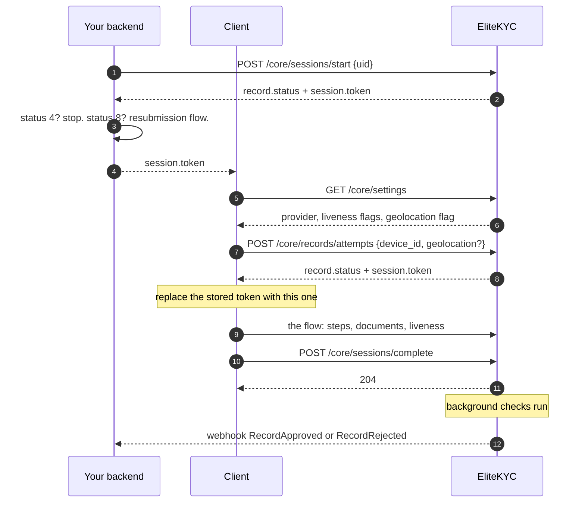

# Sessions and attempts

The lifecycle endpoints. If you only implement four calls, they are on this
page.

There is a deliberate split here worth understanding before you read further.
**Starting a session is pure authentication and never fails for business
reasons.** **Opening an attempt is where every business rule lives.** That
separation means you always get a token and a status back, and then you decide
what to do, rather than having to interpret an error to learn where the
customer stands.

---

## Start a session

<span class="ek-m post">POST</span> <span class="ek-path">/core/sessions/start</span> <span class="ek-auth">API key</span>

Issues a session token for a `uid`. If no record exists for that `uid`, a
pending one is created so the session has something to bind to.

### Request

```json
{
  "uid": "customer-001"
}
```

| Field | Type | Rules |
|-------|------|-------|
| `uid` | string | Required. Max 50 characters. Digits, a UUID, a ULID, or alphanumerics with dashes and underscores. No spaces, no `@`, no `+`. |

Valid: `12345`, `550e8400-e29b-41d4-a716-446655440000`,
`01H1W1DE6X9Z5YEP5Y8DHR3H7J`, `Customer_123`, `customer-id-001`.

Invalid: `123 456`, `123@abc`, `name+id`.

Use your own stable user identifier. Calling this twice with the same `uid`
resolves to the same record, which is what makes the call safe to retry.

### Response `200`

```json
{
  "record": {
    "id": "01H1W1DE6X9Z5YEP5Y8DHR3H7J",
    "status": 1
  },
  "session": {
    "id": "01H1W1DE7A2B3C4D5E6F7G8H9J",
    "token": "eyJhbGciOiJIUzI1NiIs...",
    "expires_at": "2026-08-26T12:30:00Z"
  }
}
```

`record.status` is the thing to branch on. It tells you whether this customer
needs verifying at all.

### Response `422`

`uid` failed validation.

### Example

```bash
curl -X POST https://ekyc.demo.elitesoft.iq/api/core/sessions/start \
  -H "Authorization: Basic $AUTH" \
  -H "Content-Type: application/json" \
  -d '{"uid": "customer-001"}'
```

---

## Open an attempt

<span class="ek-m post">POST</span> <span class="ek-path">/core/records/attempts</span> <span class="ek-auth">session</span>

Opens or resumes an attempt on the record bound to the token. Every business
rule is enforced here: the resubmission gate, the geolocation requirement,
schema wiring, marking the record started, recording the device.

### Request

```json
{
  "device_id": "device-abc",
  "geolocation": {
    "latitude": 33.3152,
    "longitude": 44.3661
  }
}
```

| Field | Type | Notes |
|-------|------|-------|
| `device_id` | string | Your device identifier. Recorded on the attempt. |
| `geolocation` | object | Required when the tenant has geolocation enabled. Check `geolocation_enabled` from [tenant settings](#tenant-settings). |

### Response `200`

```json
{
  "record": {
    "id": "01H1W1DE6X9Z5YEP5Y8DHR3H7J",
    "status": 2
  },
  "session": {
    "id": "01H1W1DE7A2B3C4D5E6F7G8H9J",
    "token": "eyJhbGciOiJIUzI1NiIs...",
    "expires_at": "2026-08-26T12:30:00Z"
  }
}
```

!!! warning "The token in this response can be a new one"
    When the current record is in a terminal state and a new attempt is
    permitted, meaning `Cancelled`, or `Rejected` on a tenant with resubmission
    enabled, a **new record** is created and the session is rebound to it.

    The response then carries a **freshly issued JWT**, and the client must use
    it for every subsequent call. Continuing with the old token addresses the
    old record.

    Always take `session.token` from this response and replace whatever you
    were holding. Doing that unconditionally is correct in both cases.

### Response `400`

| Code | Meaning |
|------|---------|
| `Kyc.RecordAlreadyApproved` | Already verified. Nothing to attempt. |
| `Kyc.AttemptInFlight` | A previous attempt is awaiting review. |
| `Kyc.RecordRejectedNotResubmittable` | Rejected, and this tenant does not allow retries. The session is read-only. |
| `Kyc.GeolocationRequired` | Geolocation is enabled and none was supplied. |

### Response `404`

Session or record not found.

---

## Complete a session

<span class="ek-m post">POST</span> <span class="ek-path">/core/sessions/complete</span> <span class="ek-auth">session</span>

Marks the session complete and hands the record to the checks. Call this once,
at the end of the flow.

No request body. The record comes from the token.

### Response `204`

Empty.

!!! info "This is a handoff, not a decision"
    The response says the record was accepted for processing. Document checks,
    liveness evaluation and AML screening then run in the background, on the
    order of seconds to minutes.

    The outcome arrives at your backend as a
    [`RecordApproved`](webhooks.md#recordapproved) or
    [`RecordRejected`](webhooks.md#recordrejected) webhook. Do not poll, and do
    not hold a request open waiting.

### Response `400`

The record is not in a state that can be completed.

---

## Tenant settings

<span class="ek-m get">GET</span> <span class="ek-path">/core/settings</span> <span class="ek-auth">API key or session</span>

Everything a client needs to drive the flow correctly. The one endpoint that
accepts either credential.

### Response `200`

```json
{
  "geolocation_enabled": true,
  "verification_method": 1,
  "licence": null,
  "passive_liveness": true,
  "active_liveness": false,
  "document_classifier_threshold": 0.85,
  "allow_resubmission": true,
  "allow_step_back": true
}
```

| Field | Type | What it drives |
|-------|------|----------------|
| `geolocation_enabled` | bool | Whether the client must collect and send location. |
| `verification_method` | int | `1` Azure, `2` Innovatrics. Decides which [liveness endpoints](liveness.md) to call. |
| `licence` | string or null | Innovatrics SDK licence. Null on Azure tenants. |
| `passive_liveness` | bool | Whether passive liveness is required. |
| `active_liveness` | bool | Whether active liveness is required on top. |
| `document_classifier_threshold` | float | Minimum classifier confidence, 0 to 1, to accept a document type. `0` skips classification. |
| `allow_resubmission` | bool | Whether a rejected record can be retried. |
| `allow_step_back` | bool | Whether to show a back button. When false, `POST /flow/step/previous` is also rejected server-side. |

!!! tip "Read this at launch. Do not hardcode any of it."
    Every field here is a per-tenant back-office setting. Moving from Azure to
    Innovatrics, turning on active liveness, enabling geolocation: all of them
    should change your client's behaviour without a release. Fetch these
    settings when the flow starts and branch on them.

### Response `404`

`TenantManagement.SettingsNotFound`.

---

## The full sequence



---

Next: [Flow and schemas](flow.md).
