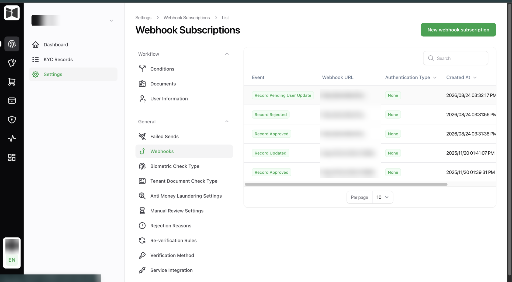
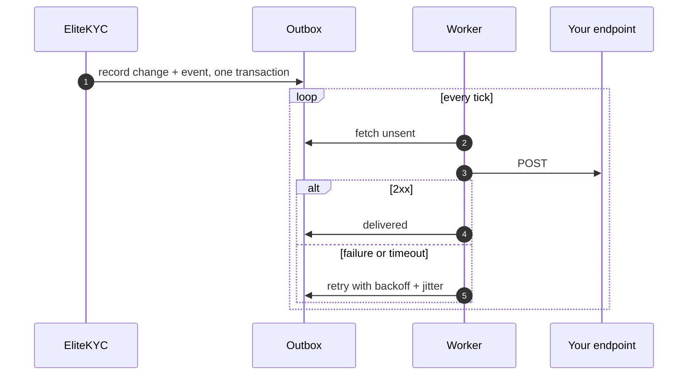
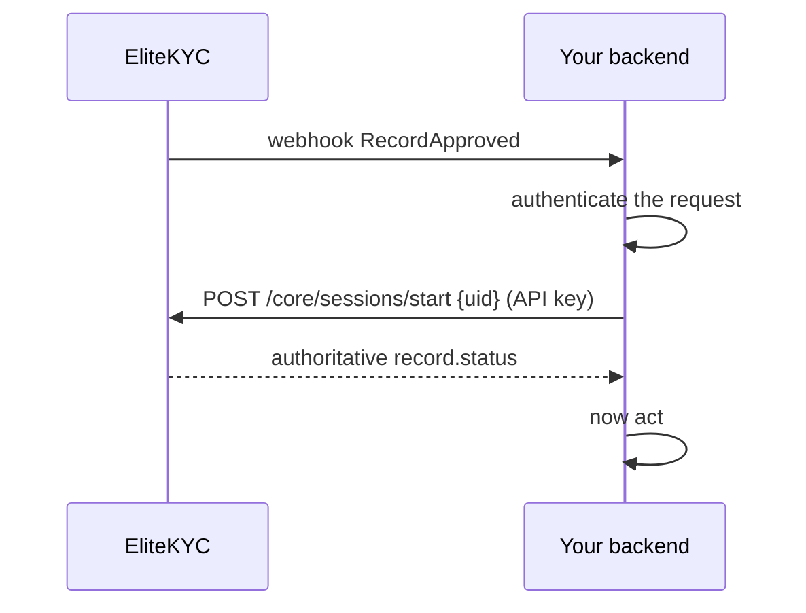

# Webhooks

How your backend learns anything happened. Verification is asynchronous, so
this page is not optional reading.

## Setting one up

Webhook subscriptions live in the back office under Webhooks. One subscription
is one event type pointed at one URL, so subscribing to three events means
three subscriptions.

<figure class="ek-wide" markdown>

<figcaption>Subscriptions in the back office. One event type, one URL, one auth mode each.</figcaption>
</figure>

| Setting | What it does |
|---------|--------------|
| Event type | Which event this subscription receives. |
| URL | Where we POST. |
| Auth type | None, bearer token, basic auth, or an API key header. |
| Custom headers | Extra headers on every delivery. |
| Retries | How many times to retry a failure. |
| Priority | Retry for the full 72-hour window regardless of the retry count. |
| Filters | Narrow which records trigger this subscription. |

### Authentication options

You choose how a delivery proves it is us.

=== "Bearer token"

    ```http
    Authorization: Bearer <your token>
    ```

    Configure the token value on the subscription.

=== "Basic auth"

    ```http
    Authorization: Basic <base64(username:password)>
    ```

    Configure username and password on the subscription.

=== "API key header"

    ```http
    X-API-KEY: <your key>
    ```

    Both the header name and the value are configurable. `X-API-KEY` is the
    default name.

=== "Custom headers"

    Any headers you define, sent on every delivery. Useful for a gateway that
    expects something specific.

## Delivery format

`POST`, `Content-Type: application/json`, `Accept: application/json`, body in
snake_case. Timeout is 10 seconds.

Respond `2xx`. Anything else, or a timeout, counts as a failure and schedules a
retry.

## Events

| Event | Value | Fires when |
|-------|:-----:|-----------|
| [`SessionCreated`](#sessioncreated) | 1 | A session is started for a record. |
| [`SessionCompleted`](#sessioncompleted) | 2 | The customer finishes the flow. |
| `DocumentRejected` | 4 | A document is rejected in review. |
| [`RecordUpdated`](#recordupdated) | 8 | Record data changes. |
| [`RecordRejected`](#recordrejected) | 9 | The record is rejected. |
| [`RecordApproved`](#recordapproved) | 10 | The record is approved. |
| [`RecordPendingUserUpdate`](#recordpendinguserupdate) | 11 | Specific documents were rejected and the customer must resubmit. |
| [`RecordReVerificationRequired`](#recordreverificationrequired) | 20 | A re-verification rule fired. |

The three most integrations need: `RecordApproved`, `RecordRejected`,
`RecordPendingUserUpdate`.

## Common shape

Every payload carries `record` and `webhook`. Some add more.

```json
{
  "record": {
    "record_id": "01H1W1DE6X9Z5YEP5Y8DHR3H7J",
    "user_id": "customer-001",
    "status": 4,
    "status_value": "Approved",
    "rejection_comment": null,
    "rejection_reason_name": null,
    "rejection_reason_description": null
  },
  "webhook": {
    "event_type": "RecordApproved",
    "event_type_value": 10,
    "eventable_id": null
  }
}
```

`user_id` is the `uid` you supplied at session start, which is how you join the
event back to your own user without storing our record id.

`status` and `status_value` are the same thing twice. Branch on `status`, log
`status_value`.

---

## RecordApproved

The one that matters. The customer is verified.

```json
{
  "record": {
    "record_id": "01H1W1DE6X9Z5YEP5Y8DHR3H7J",
    "user_id": "customer-001",
    "status": 4,
    "status_value": "Approved",
    "rejection_comment": null,
    "rejection_reason_name": null,
    "rejection_reason_description": null
  },
  "documents": [
    {
      "id": "01H1W1DF8K2M3N4P5Q6R7S8T9V",
      "record_id": "01H1W1DE6X9Z5YEP5Y8DHR3H7J",
      "user_id": "customer-001",
      "status": 4,
      "status_value": "Approved",
      "document_type_id": "01H1W1DG9L3N4P5Q6R7S8T9V0W",
      "document_type": "IQ_NATIONAL_CARD",
      "data": {
        "first_name": "John",
        "surname": "Doe",
        "national_id": "9876543210",
        "date_of_birth": "1990-05-15",
        "expire_date": "2030-01-01"
      }
    }
  ],
  "webhook": {
    "event_type": "RecordApproved",
    "event_type_value": 10,
    "eventable_id": null
  }
}
```

`documents` carries the active documents, one per type, with their extracted
data. If your system stores the customer's verified name or national ID, this
is where it comes from and you do not need a follow-up API call.

## RecordRejected

```json
{
  "record": {
    "record_id": "01H1W1DE6X9Z5YEP5Y8DHR3H7J",
    "user_id": "customer-001",
    "status": 5,
    "status_value": "Rejected",
    "rejection_comment": "Document does not match the applicant",
    "rejection_reason_name": "Identity mismatch",
    "rejection_reason_description": "The document holder is not the applicant"
  },
  "webhook": {
    "event_type": "RecordRejected",
    "event_type_value": 9,
    "eventable_id": null
  }
}
```

Rejection reasons come from a catalogue your compliance team maintains, so
`rejection_reason_name` is stable enough to branch on and
`rejection_comment` is the reviewer's free text.

Whether the customer may try again depends on `allow_resubmission` in
[tenant settings](sessions.md#tenant-settings).

## RecordPendingUserUpdate

Specific documents were rejected. The customer resubmits only those.

```json
{
  "record": {
    "record_id": "01H1W1DE6X9Z5YEP5Y8DHR3H7J",
    "user_id": "customer-001",
    "status": 8,
    "status_value": "PendingUserUpdate",
    "rejection_comment": null,
    "rejection_reason_name": null,
    "rejection_reason_description": null
  },
  "documents": [
    {
      "id": "01H1W1DF8K2M3N4P5Q6R7S8T9V",
      "record_id": "01H1W1DE6X9Z5YEP5Y8DHR3H7J",
      "user_id": "customer-001",
      "status": 8,
      "status_value": "PendingUserUpdate",
      "document_type_id": "01H1W1DG9L3N4P5Q6R7S8T9V0W",
      "document_type": "IQ_PASSPORT",
      "rejection_comment": "Photo page is blurry",
      "rejection_reason_name": "Illegible document",
      "rejection_reason_description": "The document could not be read"
    }
  ],
  "webhook": {
    "event_type": "RecordPendingUserUpdate",
    "event_type_value": 11,
    "eventable_id": "01h1w1dj4r8t9v0w1x2y3z4a5b"
  }
}
```

`eventable_id` is the document change request id, lowercased. Use it to fetch
the change-request secret and build the deep link that sends the customer back
into the SDK. See
[document resubmission](../sdk/advanced.md#document-resubmission).

The `documents` array tells the customer exactly what to fix. Show
`rejection_comment` and `rejection_reason_description`, because "your passport
photo is blurry" retains far more people than "verification failed".

## RecordReVerificationRequired

A re-verification rule fired on an already-approved customer.

```json
{
  "record": { "...": "as above" },
  "re_verification": {
    "record_id": "01H1W1DE6X9Z5YEP5Y8DHR3H7J",
    "tenant_id": "01H1W1D00000000000000000AA",
    "rule_id": "01H1W1DK5S9V0W1X2Y3Z4A5B6C",
    "dcr_id": "01H1W1DJ4R8T9V0W1X2Y3Z4A5B",
    "doc_types": ["IQ_PASSPORT"],
    "fired_at": "2026-08-26T10:00:00Z",
    "blocking": true,
    "time_limit_deadline": "2026-09-09T10:00:00Z"
  },
  "webhook": {
    "event_type": "RecordReVerificationRequired",
    "event_type_value": 20,
    "eventable_id": null
  }
}
```

| Field | Meaning |
|-------|---------|
| `doc_types` | Which documents need re-verifying. |
| `blocking` | Whether the customer should be locked out until they finish. |
| `time_limit_deadline` | When their window closes. Null means no deadline. |
| `dcr_id` | The document change request to drive the resubmission flow. |

!!! warning "`blocking: true` is a request, not an enforcement"
    We tell you the customer should be blocked. **Your app blocks them.** The
    verification engine never locks anyone out of your product.

    That boundary is deliberate. You decide what "blocked" means: read-only
    access, no new transfers, a full lockout. We do not get to make that call
    about your product.

## SessionCreated

```json
{
  "record": { "...": "" },
  "session": {
    "session_id": "01H1W1DE7A2B3C4D5E6F7G8H9J",
    "session_type": "Onboarding",
    "expires_at": "2026-08-26T12:30:00Z",
    "record_status": "Pending",
    "record_status_value": 1
  },
  "webhook": {
    "event_type": "SessionCreated",
    "event_type_value": 1,
    "eventable_id": null
  }
}
```

## SessionCompleted

Same shape as `SessionCreated` with `event_type_value: 2`.

Fires when the customer finishes the flow, before the checks have run. Useful
for showing a pending state. It is not an outcome.

## RecordUpdated

Record data changed, usually from a reviewer's edit. Carries `record` and
`webhook` only.

---

## Delivery semantics

The part that decides whether your integration is reliable.

### The outbox

Events are written **in the same database transaction** as the change that
caused them. If the change rolls back, no event exists. If the change commits,
the event is durably queued whether or not your endpoint is reachable.



### Retries

Exponential backoff with jitter, capped at 24 hours between attempts, inside a
**72-hour window** from the event.

- **Standard subscriptions** retry up to the retry count you configure, then
  mark the delivery failed.
- **Priority subscriptions** keep retrying for the full 72 hours regardless of
  the count.

A circuit breaker sits in front of delivery, so a consistently failing endpoint
stops being hammered and gets retried on the schedule instead.

Failed deliveries are visible in the back office under Webhooks, Failed Sends,
with the response code and body we received. That is the first place to look
when something did not arrive.

### What this means for your handler

**Be idempotent.** A delivery can arrive more than once. Retries happen, and
so does redelivery after a timeout where you actually processed the request.
Key on `record_id` and `event_type`, and make reprocessing a no-op.

**Return quickly.** Ten-second timeout. Acknowledge, queue the work, return
`2xx`. Do not do your own slow work inside the handler.

**Do not rely on ordering.** Deliveries are independent and retries reorder
things. Treat `record.status` in the payload as the current truth rather than
inferring state from the sequence of events you saw.

**Handle unknown event types.** New events get added. Ignore what you do not
recognise and return `2xx` rather than erroring.

## Verifying a delivery came from us

There is no HMAC payload signature today. Two things to do instead.

**Authenticate the request.** Configure bearer, basic or API-key auth on the
subscription and reject deliveries that do not carry it. Combine with an IP
allowlist if your gateway supports one.

**Treat the webhook as a notification, not as data.** For anything that moves
money or grants access, read the state back before acting rather than trusting
the body:



`POST /core/sessions/start` is the read-back path available to an API key. It
resolves the existing record for that `uid` and returns its current status, so
a forged payload cannot make you act on a status the server does not agree
with.

!!! note "The read-back costs you a SessionCreated event"
    Starting a session emits `SessionCreated`. If you subscribe to that event
    and also read back on every webhook, you will see extra deliveries. Either
    do not subscribe to `SessionCreated`, or ignore the ones your own read-back
    caused.

    `GET /core/records/{id}/checks` gives richer detail but needs a session
    token, so it costs the same event plus an extra call.

If you need cryptographic proof of origin instead, raise it during scoping.

---

Next: [Errors](errors.md).
