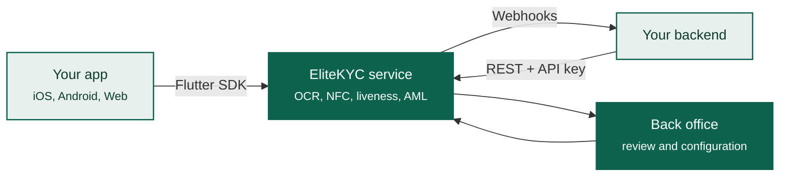

---
hide:
  - navigation
---

EliteKYC

# Verify who your customers are, in about ninety seconds

EliteKYC captures an identity document, reads it, proves the person holding it
is alive and present, screens them against sanctions lists, and hands your
system a decision. You get a mobile SDK, a REST API and a review console. You
write the part that matters to your product.

-   :material-rocket-launch: **Ship a working flow today**

    ---

    One backend call, one SDK call. The [quickstart](quickstart.md) takes you
    from credentials to a verified test user.

    [:octicons-arrow-right-24: Quickstart](quickstart.md)

-   :material-cellphone: **Drop the flow into your app**

    ---

    A Flutter SDK that renders the whole journey. Your colours, your language,
    your navigation stack.

    [:octicons-arrow-right-24: Mobile SDK](sdk/index.md)

-   :material-api: **Or build the UI yourself**

    ---

    Every screen the SDK draws is a documented endpoint. Use the SDK, the API,
    or a mix of both.

    [:octicons-arrow-right-24: API reference](api/index.md)

-   :material-clipboard-check: **Review what needs a human**

    ---

    A back office with maker-checker review, audit history and configurable
    rules. No engineering time to operate it.

    [:octicons-arrow-right-24: Back office](portal/index.md)

## What you are looking at

Three pieces that fit together, and you can adopt them in any combination.

The **SDK** owns the customer-facing journey: document capture, chip reading,
liveness, dynamic forms. The **API** is the same surface the SDK talks to, open
to you if you would rather draw your own screens. The **back office** is where
your compliance team configures the flow and reviews anything the automated
checks could not settle on their own.

## Where to go next

| You are | Start here |
|---------|-----------|
| Deciding whether to evaluate us | [What EliteKYC does](overview/what-is-elitekyc.md) and [Capabilities](overview/features.md) |
| Scoping the integration | [How verification works](overview/how-it-works.md), then [Architecture](overview/architecture.md) |
| Writing the mobile app | [Mobile SDK](sdk/index.md) |
| Writing the backend | [API overview](api/index.md) and [Webhooks](api/webhooks.md) |
| On the security review | [Security and data](overview/security.md) |
| In compliance or operations | [Back office](portal/index.md) |

!!! info "You will need credentials from us"
    EliteKYC is not self-serve. Document types, form schemas and check
    thresholds are configured per tenant, so an account starts with a
    conversation. Everything in these docs is accurate without one, and the
    demo environment is available as soon as you ask.

    Contact [support@elitesoft.iq](mailto:support@elitesoft.iq).
