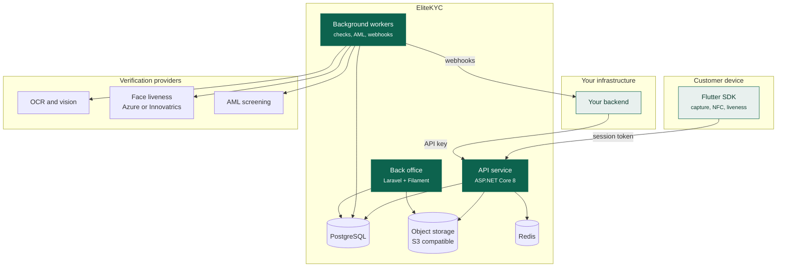
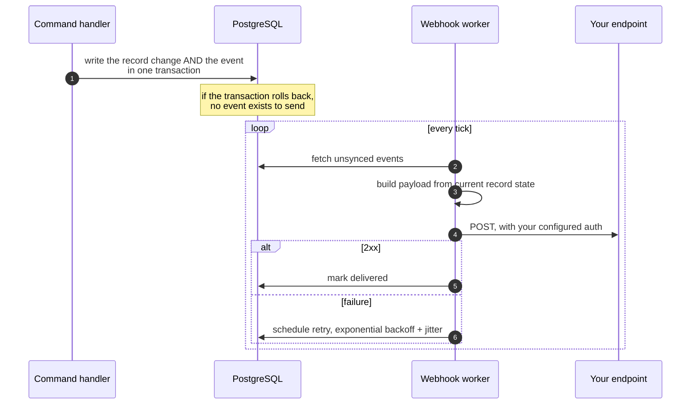

# Architecture

How the system is put together, what talks to what, and which parts you have to
care about.

## The three components

### API service

ASP.NET Core 8 with FastEndpoints, laid out as four layers. Domain holds the
entities and business rules and depends on nothing. Application holds the
command and query handlers. Infrastructure holds the database, storage and
vendor integrations. The API layer holds one file per endpoint.

Requests are handled synchronously only for work that is genuinely fast.
Anything involving a vendor call happens on a background worker, which is why
`POST /core/sessions/complete` returns immediately and the result arrives by
webhook.

### Background workers

Five timed services, each holding a distributed lock so only one instance in a
cluster runs a given job at a time.

| Worker | Job |
|--------|-----|
| Document check | Runs expiry, front-and-back, classification and face-match checks on submitted documents. |
| AML check | Screens submitted records against sanctions and watchlists. |
| Re-verification evaluator | Finds records that match an active re-verification rule and fires it. |
| Webhook check | Picks up unsent events, builds payloads and delivers them. |
| Webhook retry | Redelivers failures on an exponential backoff. |

Each worker batches, and the batch size and interval are configuration.

### Back office

A Laravel module built on Filament, running against the same PostgreSQL
database. Two panels: a tenant panel your compliance team uses, and a platform
admin panel we use for things like registering new document types.

Record search is backed by Typesense, synced on a schedule, so a table of
millions of records still filters instantly.

## The webhook path

Webhooks use the outbox pattern, which is why a delivery is never lost because
your endpoint was down.

A circuit breaker sits in front of delivery, so an endpoint failing
consistently stops being hammered and gets retried on the schedule instead. The
retry window is 72 hours from the event, with per-subscription retry counts and
a priority flag for subscriptions that should keep retrying for the full window
regardless.

## Multi-tenancy

Every tenant-owned table carries a tenant id, and Entity Framework applies a
global query filter, so a query written without a tenant clause still cannot
return another tenant's rows. The tenant is resolved from the authenticated
credential, before any handler runs.

Background workers have no tenant context, because they process every tenant's
work. They use explicitly named repository methods that bypass the filter, so
crossing the tenant boundary is always a deliberate, greppable act rather than
an omission.

## Storage

| Data | Where | Notes |
|------|-------|-------|
| Records, document metadata, checks, history | PostgreSQL | The system of record. |
| Document images and selfies | S3-compatible object storage | Served to the back office as short-lived presigned URLs, never as public objects. |
| Sessions, locks, cached settings | Redis | Transient. |

## Deployment

Containerised, deployed to DigitalOcean with images published to GitHub
Container Registry, promoted through development, staging, demo and production.
Health checks are exposed at `/health` and cover database reachability.

Observability is Serilog to console and Seq, Sentry for errors and traces, and
New Relic for application performance. Business events are separately recorded
as record history, which is what compliance reads. The two are deliberately
distinct: logs are for engineers and expire, history is for auditors and does
not.

## What this means for your integration

Three things follow from the design, and they are the three that shape your
code.

**Everything slow is asynchronous.** Do not build a UI that waits for a
verification result. Complete the session, tell the customer you will let them
know, and act on the webhook.

**Status is the contract.** You do not need to understand checks, scores or
review workflow to integrate. You need to react to a record reaching `Approved`
or `Rejected`, and to `PendingUserUpdate` when the customer has to resubmit.

**Configuration is not deployment.** Thresholds, form fields, document
combinations and re-verification rules change in the back office. Your code
does not know about them, which is the point.

---

Next: [Security and data](security.md).
