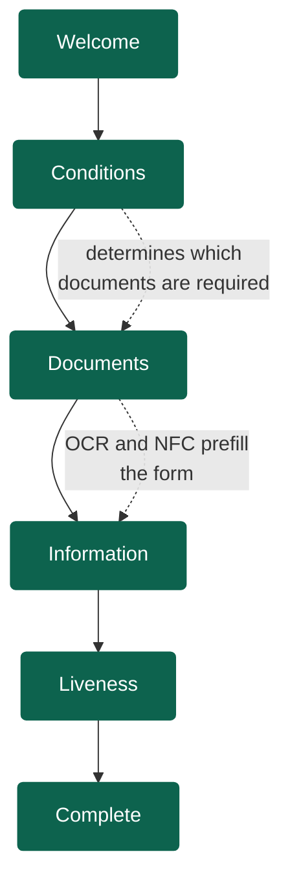
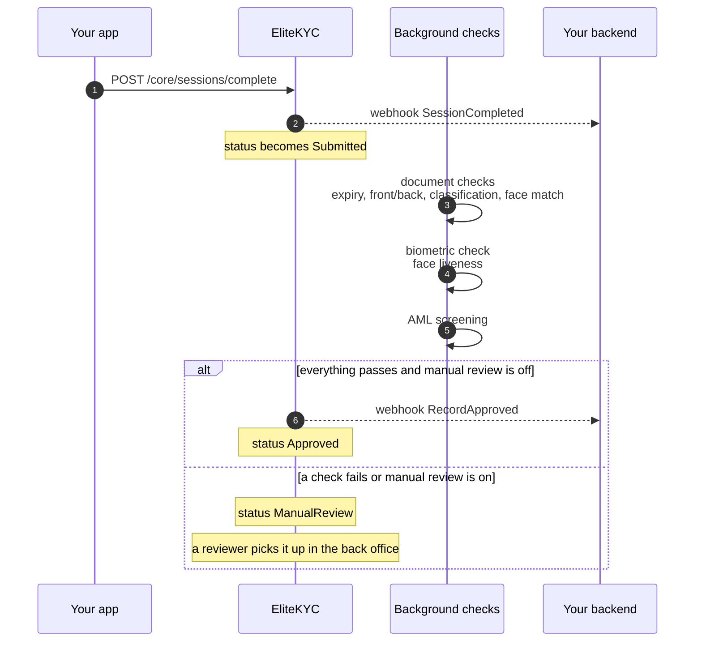
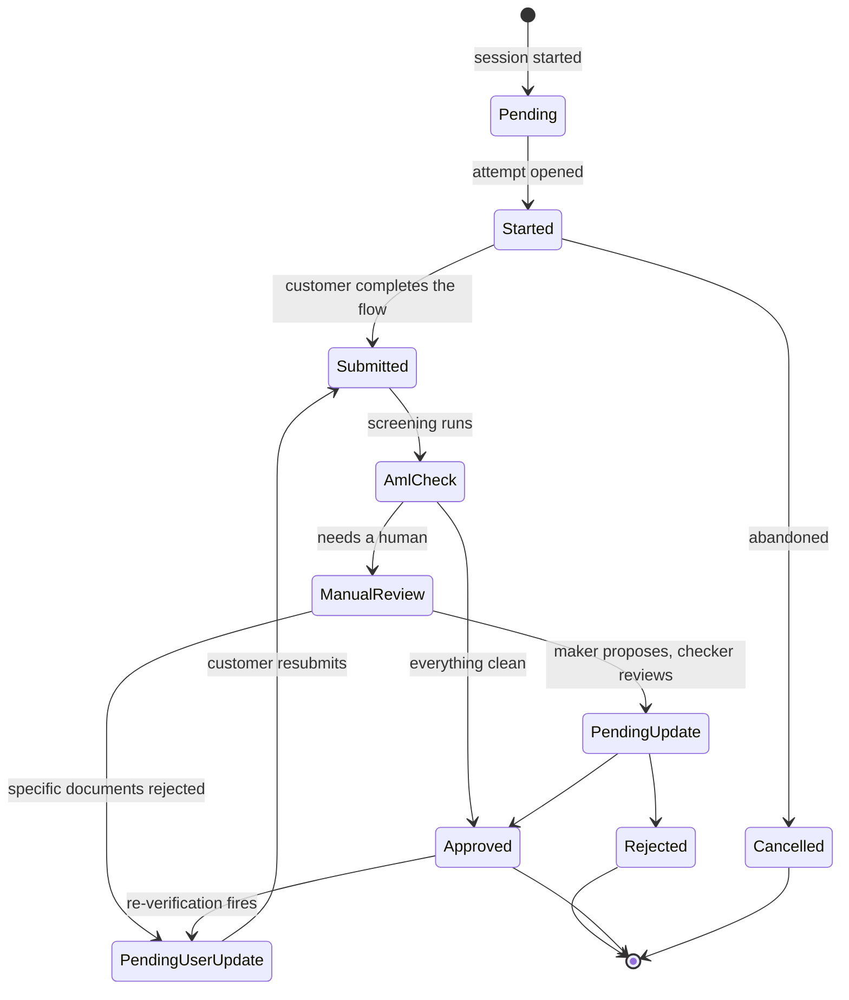
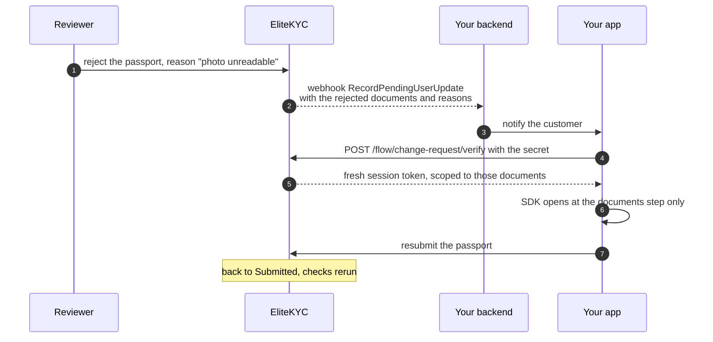

# How verification works

The customer's journey, the record's lifecycle, and what your system sees at
each point.

## The customer journey

Six steps. Which ones appear depends on what your tenant is configured to
require, and the answers the customer gives along the way.



**Welcome** introduces the process and asks for camera permission.

**Conditions** is a short form whose answers decide the rest of the flow. A
typical first question is whether the person is a citizen, a resident or a
visitor, because that changes which documents they can present.

**Documents** captures each required document. The camera guides the framing
and rejects blurry, glared or dark frames before they are ever uploaded. If the
document has an NFC chip and the phone can read it, the chip is read too, which
gives you signed data from the issuing authority rather than characters guessed
from a photograph.

**Information** is a dynamic form. Fields the documents already answered come
prefilled, so the customer confirms rather than types.

**Liveness** takes a selfie and proves the person is physically present. The
same selfie is matched against the portrait on the document.

**Complete** ends the flow. Everything after this happens without the customer
waiting.

## What happens after the customer leaves

Submission is not a decision. Background workers pick the record up and run the
checks that take real time.



Your backend learns the outcome from a webhook. You never poll, and you never
hold a request open waiting for OCR.

## The record lifecycle

Every customer has one record per verification attempt, and the record's status
is the single thing your system needs to track.



The statuses in full, with the numeric value the API and webhooks send:

| Status | Value | Meaning |
|--------|-------|---------|
| `Pending` | 1 | A record exists but the customer has not begun. |
| `Started` | 2 | An attempt is open and the customer is working through it. |
| `Submitted` | 3 | The customer finished. Checks are running. |
| `Approved` | 4 | Verified. This is the state you gate your product on. |
| `Rejected` | 5 | Not verified. Whether the customer may try again depends on your tenant's resubmission setting. |
| `ManualReview` | 6 | A reviewer needs to look at it. |
| `PendingUpdate` | 7 | A maker proposed changes and a checker has not signed off yet. |
| `PendingUserUpdate` | 8 | Specific documents were rejected. The customer has to resubmit those, not the whole flow. |
| `AmlCheck` | 9 | AML screening is running. |
| `PendingAmlCheck` | 10 | Screening produced a hit and compliance has not cleared it. |
| `Cancelled` | 11 | The attempt was abandoned or cancelled. |

## The rejection loop

The path most teams underestimate. When only one document is wrong, sending the
customer through the entire flow again is a good way to lose them.



The customer retakes one photo. Everything else they already provided stands.

## Two ways to integrate

You do not have to choose one for the whole product.

=== "SDK-driven (most teams)"

    Your backend opens a session and hands the token to your app. The SDK runs
    the entire journey, talking to `/flow/*` and `/core/*` on its own. Your
    backend hears the result over webhooks.

    Fastest to ship, and you inherit camera tuning, RTL layout and liveness SDK
    integration for free.

    ```mermaid
    flowchart LR
        A[Your backend] -->|"POST /core/sessions/start"| E[EliteKYC]
        A -->|session token| B[Your app + SDK]
        B <-->|"the whole flow"| E
        E -->|webhooks| A
    ```

=== "API-driven"

    You draw every screen. Your client calls the same endpoints the SDK calls,
    in the same order, and you control the pixels completely.

    More work, and you take on the camera-quality problem and the native
    liveness SDKs yourself. Worth it when the verification flow has to be
    indistinguishable from the rest of a heavily designed product.

    ```mermaid
    flowchart LR
        A[Your backend] -->|"POST /core/sessions/start"| E[EliteKYC]
        A -->|session token| B[Your own UI]
        B <-->|"/flow/* and /core/*"| E
        E -->|webhooks| A
    ```

=== "Server-to-server"

    You already collect identity documents somewhere else and want EliteKYC to
    run the checks and hold the audit record. Push what you have to
    `POST /core/store` with an API key. No session, no SDK, no customer-facing
    flow.

    See [Records and data](../api/records.md#store-kyc-data).

---

Next: [Capabilities](features.md) for what is supported in detail, or
[Architecture](architecture.md) for how the pieces are deployed.
