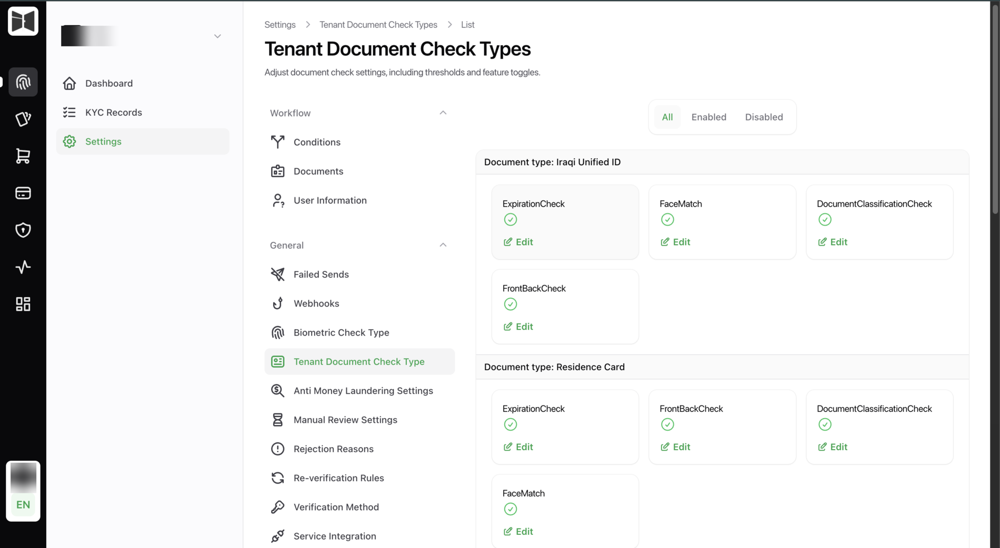
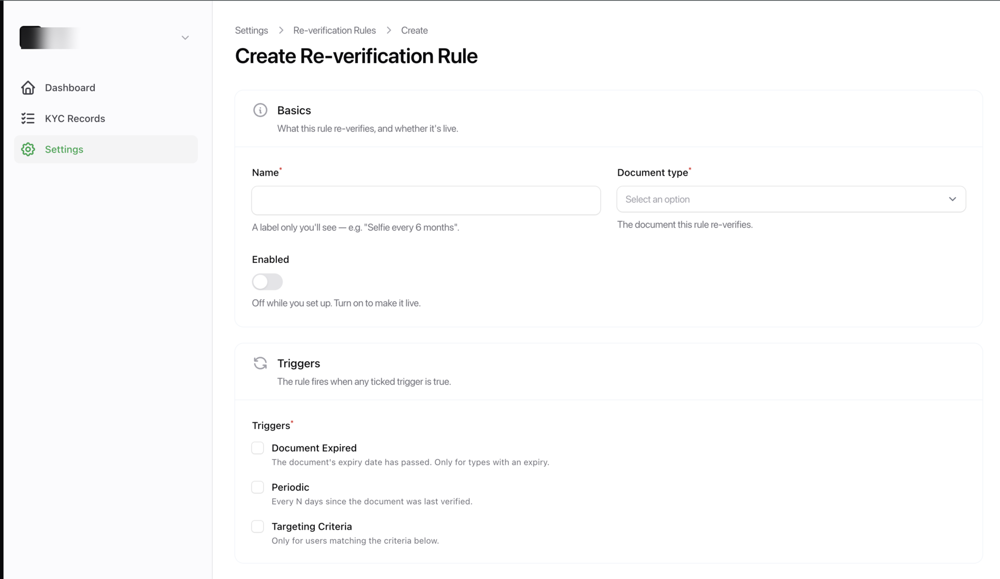

# Checks and rules

The risk configuration. Nothing here needs a deploy, and all of it changes how
your integration behaves.

<figure class="ek-wide" markdown>

<figcaption>Check configuration. Every check is switchable and tunable per document type.</figcaption>
</figure>

## Document checks

Per tenant, per check: whether it runs, and at what threshold.

| Check | Answers | Failing it usually means |
|-------|---------|--------------------------|
| Expiration | Is the document valid on the submission date? | Expired document. Straightforward rejection. |
| FrontBack | Are these two images the same card? | Mismatched pair, or a photo of a different document. |
| Classification | Is this the type the customer claimed, above the confidence threshold? | Wrong document presented, or capture quality too poor to tell. |
| FaceMatch | Is the document portrait the same person as the selfie? | Someone else's document. |

The **classification threshold** is a single tenant-wide number between 0 and 1,
also surfaced as `document_classifier_threshold` in
[tenant settings](../api/sessions.md#tenant-settings). Setting it to `0` skips
classification entirely, which is reasonable when your tenant accepts one
document type and there is nothing to classify against.

Each check produces a status, a decision and a score, all readable through
[`GET /core/records/{id}/checks`](../api/records.md#get-record-checks).

## Biometric checks

Face liveness, with its own threshold. Whether passive, active, or both are
required is set on the verification method page and surfaces as
`passive_liveness` and `active_liveness`.

## Verification method

Azure or Innovatrics, per tenant. Also the Innovatrics licence string and the
classification threshold.

!!! warning "Switching provider changes which endpoints your client calls"
    Azure uses `/core/liveness/create` then `/core/liveness/verify`.
    Innovatrics uses `/core/liveness/verify/passive` and optionally
    `/core/liveness/verify/active`. Calling the wrong family returns a `400`.

    A client that reads `verification_method` from `GET /core/settings` handles
    the switch with no release. A client that hardcodes it breaks the moment
    someone changes this dropdown, and the person changing it will not know
    that.

    See [Liveness](../api/liveness.md).

Web is Azure only. If web is part of your product, that decision is already
made.

## AML screening

On or off per tenant. When on, submitted records are screened against sanctions
and watchlists, and hits route to a user holding the AML Checker permission
rather than auto-rejecting.

Decisions are `Ok` or `Hit`, with a hit count.

## Manual review settings

Five toggles, and four of them your code has to respect.

| Setting | Effect | Your client sees it as |
|---------|--------|------------------------|
| Manual review enabled | Route every record to a human, including ones that passed everything. | Nothing. Records simply take longer. |
| Maker-checker enabled | Require a second approver. Off means direct edits. | Nothing. |
| Allow resubmission | Whether a rejected record can be retried. | `allow_resubmission` |
| Geolocation enabled | Whether location is required to open an attempt. | `geolocation_enabled` |
| Allow step back | Whether the flow has a back button. | `allow_step_back` |

Turning manual review on is the conservative launch setting: every record gets
human eyes while you build confidence in the thresholds, then you switch it off
once the score distributions look right.

## Re-verification rules

<figure class="ek-wide" markdown>

<figcaption>A re-verification rule. Triggers, targeting and rollout guardrails.</figcaption>
</figure>

Onboarding is a moment. Compliance is a state. Re-verification rules keep
approved records current.

Each rule targets one document type and fires when any of its triggers is true.

### Triggers

| Trigger | Fires when |
|---------|-----------|
| Expired | The document's expiry date has passed. Only meaningful for types that expire. |
| Periodic | Every N days since the document was last verified. |
| Targeting | The user matches the targeting criteria. |

### Targeting

Limit a rule to a subset of users, matched against each record's own data. An
empty targeting block means everyone the triggers match.

Field names are case-sensitive and match the record's data exactly.

### Rollout controls

The guardrails, and they exist because a rule covering a large book is
operationally dangerous without them.

| Control | What it does |
|---------|--------------|
| Blocking | Marks the customer as needing a lockout until they re-verify. Your app enforces it. |
| Time limit | Days the customer has to finish. Empty means no deadline. |
| Reminder | Send a reminder this many days before the deadline. |
| Max triggers per day | Cap on how many re-verifications start per day. Empty means no cap. |
| Rehearsal | Record what the rule would have done without contacting anyone. |

!!! tip "Rehearse before you go live"
    A rule that matches more people than you expected is a support incident.
    Rehearsal mode runs the rule, records the matches, and contacts nobody.

    There is a tenant-level rehearsal switch too, and while it is on no rule
    can go live regardless of its own setting. A useful safety catch while
    you are setting rules up.

### What your backend receives

A fired rule sends
[`RecordReVerificationRequired`](../api/webhooks.md#recordreverificationrequired):

```json
{
  "re_verification": {
    "rule_id": "01H1W1DK5S9V0W1X2Y3Z4A5B6C",
    "dcr_id": "01H1W1DJ4R8T9V0W1X2Y3Z4A5B",
    "doc_types": ["IQ_PASSPORT"],
    "fired_at": "2026-08-26T10:00:00Z",
    "blocking": true,
    "time_limit_deadline": "2026-09-09T10:00:00Z"
  }
}
```

!!! warning "`blocking: true` is a request, not an enforcement"
    We tell you the customer should be blocked. **Your app blocks them.** The
    verification engine never locks anyone out of your product, because what
    "blocked" means is your decision: read-only, no new transfers, full
    lockout.

Use `dcr_id` to drive the customer through document resubmission.

## Document types

Which document types exist, what they extract, whether they are two-sided, and
whether they support NFC, are configured in the platform admin panel, which we
operate.

Adding a document type is configuration on our side rather than a release on
yours. If you need a type that does not exist yet, that is a conversation, not
a project.

---

Next: the [glossary](../reference/glossary.md).
