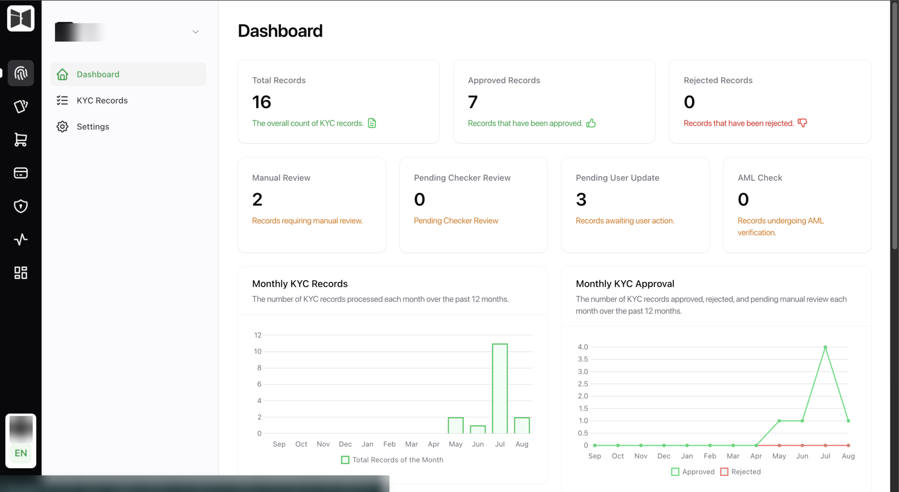

# Back office

Where your compliance and operations teams live. No engineering time to run it,
and most of what shapes your integration is configured here rather than in
code.

<figure class="ek-wide" markdown>

<figcaption>The tenant dashboard. Counts by status, and the monthly volume and approval trends.</figcaption>
</figure>

## Why an engineer should read this section

Three reasons, and they all cost you time later if you skip it.

**Your integration behaves differently depending on settings here.** Whether
geolocation is required, which liveness provider runs, whether a rejected
customer can retry, whether the back button exists. Your client reads these
from `GET /core/settings` at runtime, and if you hardcode any of them you will
be shipping a release the day risk changes a toggle.

**The forms your app renders are built here.** Conditions, information and
document combinations are schemas your compliance team edits. Adding a field is
their afternoon, not your sprint.

**Webhook subscriptions are configured here.** Your endpoint URL, the auth your
handler expects, the retry policy.

## What is in it

-   :material-clipboard-text: **Records**

    ---

    The review queue and every record's full detail: documents, extracted
    fields, check results, AML, geolocation, and the complete audit history.

    [:octicons-arrow-right-24: Reviewing records](records.md)

-   :material-form-select: **Schemas**

    ---

    Conditions, information and document combinations. Drag-and-drop builders,
    per-language labels, validation and visibility rules.

    [:octicons-arrow-right-24: Building the flow](schemas.md)

-   :material-shield-check: **Checks and rules**

    ---

    Document and biometric check thresholds, AML settings, verification
    provider, and re-verification rules.

    [:octicons-arrow-right-24: Checks and rules](checks.md)

-   :material-webhook: **Webhooks**

    ---

    Subscriptions, per-subscription auth, and a failed-delivery log with the
    response we actually got back.

    [:octicons-arrow-right-24: Webhooks](../api/webhooks.md)

## Dashboard

The landing view, aimed at whoever owns the funnel:

- KYC records over time, and month-on-month approval rate
- Status distribution across the whole book
- Completion ratio, so you can see where people drop out
- Average document score, face liveness score and face verification score
- Document type usage
- Recent records

Average scores are the leading indicator worth watching. A gradual decline
usually means capture quality is degrading, often after an app release changed
something about the camera, and it shows up here before it shows up as a spike
in manual reviews.

## Settings

Under the Settings cluster:

| Page | Controls |
|------|----------|
| Manual review | Manual review on or off, maker-checker on or off, resubmission, geolocation, step back. |
| Anti-money laundering | AML screening on or off. |
| Verification method | Azure or Innovatrics, Innovatrics licence, document classifier threshold. |
| Mobile application | App identifiers used for deep links in the document change flow. |

### The settings your code sees

Four of these surface through `GET /core/settings` and your client must respect
them:

| Setting | API field |
|---------|-----------|
| Geolocation enabled | `geolocation_enabled` |
| Allow resubmission | `allow_resubmission` |
| Allow step back | `allow_step_back` |
| Verification method | `verification_method`, plus `licence` |
| Document classifier threshold | `document_classifier_threshold` |
| Passive and active liveness | `passive_liveness`, `active_liveness` |

## Permissions

Granular rather than role-shaped, so an auditor asking "who could have approved
this" gets a precise answer.

| Permission | Grants |
|-----------|--------|
| View, ViewAny | Read one record, or the list |
| Create, Update, Delete, Restore | Record lifecycle management |
| Maker | Propose changes for a checker to approve |
| Checker | Approve or return a maker's proposal |
| Editor | Edit a record directly, bypassing maker-checker |
| AML Checker | Clear or reject an AML hit |
| AML Viewer | See AML results without acting on them |
| Record Data Correction | Correct information fields |
| Export PDF | Export a record and its evidence |

Maker and Checker are separate permissions specifically so segregation of
duties is enforceable. With maker-checker on, the same person cannot propose
and approve the same change.

Page access is permissioned separately from record access, so someone can
review records without being able to change the schemas everyone else depends
on.

## Languages

The whole back office is available in English and Arabic, including record
data, form labels and rejection reasons.

---

Next: [Reviewing records](records.md).
