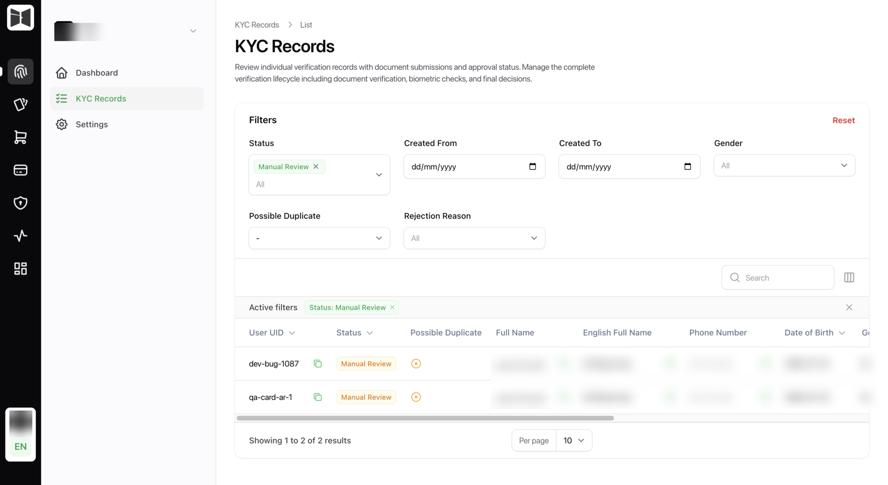
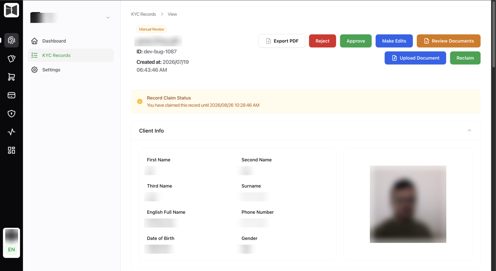
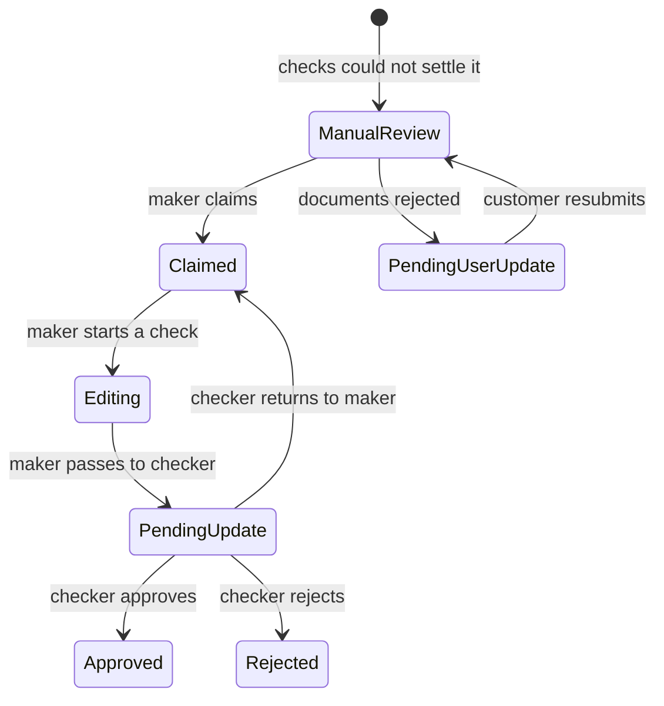
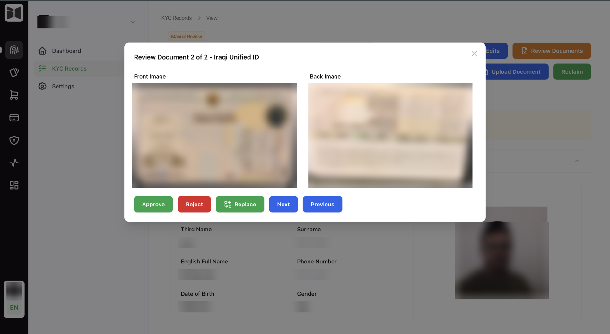

# Reviewing records

What happens to the records your integration creates once a human gets
involved.

<figure class="ek-wide" markdown>

<figcaption>The queue. Filter by status, date, gender, rejection reason or possible duplicate.</figcaption>
</figure>

## The queue

A searchable, filterable table of every record, backed by Typesense so
filtering millions of rows stays instant. Reviewers filter to `ManualReview`
and work through it.

## A record in detail

<figure class="ek-wide" markdown>

<figcaption>One record. Extracted fields on the left, the captured selfie on the right, actions along the top.</figcaption>
</figure>

Everything about one verification, in sections:

| Section | Contents |
|---------|----------|
| Client info | Identity fields, resolved from the most trustworthy source available. |
| Documents | Every document with front and back images, extracted data by source, and per-check results. |
| Information | Answers to the information form. |
| Biometric checks | Liveness and face match results with scores. |
| AML | Screening result and any hits. |
| Geolocation | Where the flow was completed, when the tenant collects it. |
| History | Every action on the record, human and automated, with actor and timestamp. |

Document images open in a lightbox at full resolution, because deciding whether
a card is genuine at thumbnail size is not a real review.

## Claiming

A reviewer claims a record before working it, which stops two people reviewing
the same case and reaching different conclusions. Claims can be released and
reclaimed, and both appear in the history.

## Maker-checker

The core control. One person proposes, another approves.



**The maker** claims the record, reviews the documents and fields, corrects
what is wrong, suggests edits, and passes it to a checker.

**The checker** reviews what the maker did and either approves, rejects, or
returns it to the maker with notes.

Field-level review means a maker can accept some extracted fields and correct
others, with the original preserved beside the correction. A reviewer later can
always see both what OCR read and what a human decided it should say.

With maker-checker off, users holding the Editor permission edit records
directly. Faster, and it gives up the segregation of duties, which is a choice
your compliance team makes rather than a default we pick.

## Document review

<figure class="ek-wide" markdown>

<figcaption>Document review. Front and back side by side, approved or rejected one document at a time.</figcaption>
</figure>

Documents are accepted or rejected individually, each with a rejection reason
from your catalogue plus the reviewer's own comment.

Rejecting one document moves the record to `PendingUserUpdate` and creates a
document change request. What your backend gets:

```json
{
  "record": { "status": 8, "status_value": "PendingUserUpdate" },
  "documents": [
    {
      "document_type": "IQ_PASSPORT",
      "rejection_comment": "Photo page is blurry",
      "rejection_reason_name": "Illegible document",
      "rejection_reason_description": "The document could not be read"
    }
  ],
  "webhook": { "event_type": "RecordPendingUserUpdate", "eventable_id": "01h1w1dj4r..." }
}
```

The customer redoes one photo, not the whole flow. See
[document resubmission](../sdk/advanced.md#document-resubmission).

## Rejection reasons

A catalogue your compliance team maintains, in English and Arabic. Reusable
across records, which is what makes them worth branching on: `rejection_reason_name`
is stable, `rejection_comment` is free text.

Keep the catalogue tight. Reasons written for the customer to read retain
people. "Illegible document" is actionable. "Verification failed" is not.

## AML review

AML hits do not silently reject anyone. A record with a hit goes to a user
holding the AML Checker permission, who passes or rejects it manually, and both
actions land in the history as `AML Manual Pass` or `AML Manual Reject`.

The AML Viewer permission exists separately so people who need to see screening
results are not automatically able to clear them.

## Audit history

Every action, human and automated, with actor and timestamp:

| Recorded action | Origin |
|-----------------|--------|
| Record created, record updated | System |
| Claimed, reclaimed | Reviewer |
| Maker reviewed, checker reviewed, return to maker | Reviewer |
| Manual edit, manual approve, manual reject | Reviewer |
| Documents reviewed | Reviewer |
| Document check completed or failed | Automated |
| Biometric check completed or failed | Automated |
| AML check passed, failed, or hit detected | Automated |
| AML manual pass, AML manual reject | Reviewer |
| Webhook delivered, webhook failed | Automated |

Automated actions are in the same trail as human ones on purpose. A history
with gaps where a machine acted is not an audit trail.

Business history is deliberately separate from application logs. Logs are for
engineers and expire. History is for auditors and does not.

## PDF export

A record and its evidence as one file, for regulators, disputes, or an internal
audit that does not have console access. Gated behind the Export PDF permission
because it takes a full identity dossier out of the system.

---

Next: [Building the flow](schemas.md).
