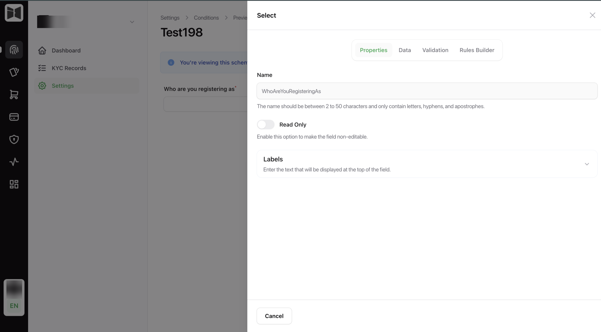
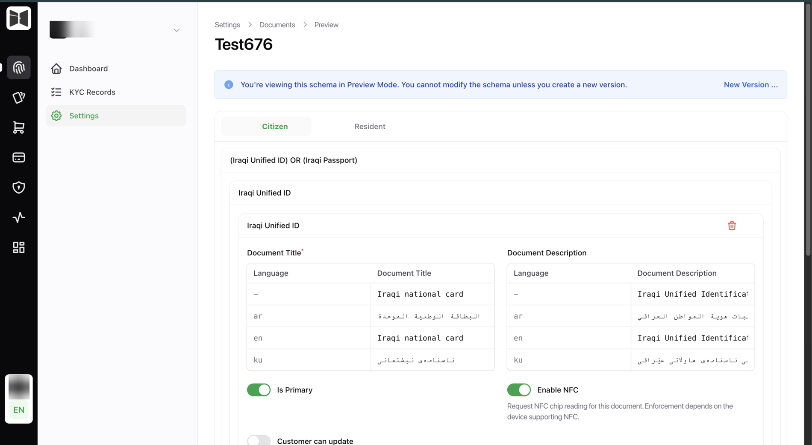
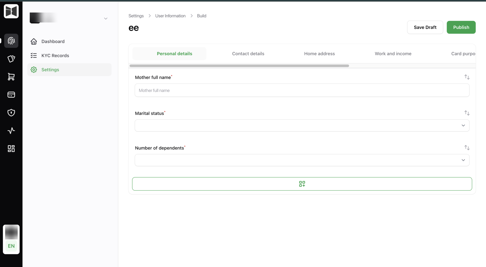

# Building the flow

Three schemas define what the customer is asked. All three are edited in the
back office by people who do not write code, and your app renders whatever they
publish.

This is the part of the product that most changes how much work you do over
time. A new question, a new document combination, a new validation rule: none
of them touch your app.

## Conditions

<figure class="ek-wide" markdown>

<figcaption>A conditions field. Properties, data, validation and visibility rules, all without code.</figcaption>
</figure>

A short form whose answers decide the rest of the flow. Typically the first
question is what kind of applicant this is, because that determines which
documents are acceptable.

Conditions attach to document groups. Answer "resident" and the residence card
group is required. Answer "citizen" and the national ID group is.

Your app fetches it from [`GET /flow/conditions`](../api/flow.md#conditions)
and submits answers back to the same path.

!!! warning "Option values are case-sensitive"
    Submit the schema's `value`, not the label you rendered. `"Citizen"` and
    `"citizen"` are different answers.

## Documents

<figure class="ek-wide" markdown>

<figcaption>The documents schema. An either/or group per customer type, with NFC and primary flags per document.</figcaption>
</figure>

Which document combinations are acceptable. Groups express alternatives: the
customer satisfies **one** group by providing **every** document in it.

"A national card, or a passport and a visa together" is two groups. Not a
special case in your code, and not a conversation with engineering.

Per document type, the builder controls:

- Whether it is required or optional within its group
- Which sides are captured
- Whether NFC reading is attempted
- Which extracted fields map onto record fields
- Which checks run against it

Your app fetches it from
[`GET /flow/documents`](../api/flow.md#documents-schema).

## Information

<figure class="ek-wide" markdown>

<figcaption>The information schema. Tabbed sections across the top, fields dragged into order, published as a version.</figcaption>
</figure>

Everything else you need to collect. A drag-and-drop builder with sections,
field types, validation and conditional visibility.

### Field types

| Type | Renders as |
|------|-----------|
| String | Single-line text |
| Number | Numeric input |
| Select | Dropdown with defined options |
| Textarea | Multi-line text |
| Checkbox | Boolean |
| Date | Date picker |
| File | File upload |
| Image | Image upload |
| Language | Language picker |
| Phone number | Phone input with country handling |
| Signature | Signature pad |
| Repeater | Repeating group of fields |
| Header | Section heading |
| Paragraph | Explanatory text |

### Per-field configuration

Three tabs on every field.

**Properties.** Name, per-language labels and placeholders, a fallback default,
read-only, and options for selects. Labels and placeholders are entered per
language, so a form built once works in all three.

**Validation.** Required, length and range bounds, patterns. Enforced on the
client by the SDK and again on the server, so a client that skips validation
does not get bad data in.

**Rules.** Visibility conditions referencing earlier answers. A field appears
only when the rules match, which is how one schema serves several kinds of
applicant without asking everyone everything.

### Prefill from documents

Any field can be mapped to a document field, and it arrives prefilled from OCR
or NFC. The customer confirms rather than retypes.

This is worth using aggressively. Every field the documents can answer is a
field the customer cannot fat-finger, and typed data disagreeing with
machine-read data is a manual review waiting to happen.

Fields that map onto record-level attributes, first through fourth name, date
of birth and gender, populate the record itself rather than just the form.

## Schema lifecycle

Schemas are versioned. A schema is a draft while it is being edited, published
when it goes live, and archived when it is superseded.

!!! info "In-flight records keep the schema they started on"
    A customer halfway through the flow when you publish a new schema finishes
    on the old one. Publishing does not break anyone mid-journey.

    That also means a field you add today does not appear on records already in
    review. Plan a migration if you need the new field everywhere.

## What this means for your app

**Render the schema, do not hardcode the form.** If your app has a screen with
the fields typed out, every schema change becomes a release and the whole
mechanism is wasted. Using the SDK is the easy way to get this right.

**Handle field types you do not recognise.** Types get added. Degrade to a text
input rather than crashing.

**Do not assume any field exists.** Reading `data.national_id` directly breaks
the day someone removes it or a document does not carry it.

---

Next: [Checks and rules](checks.md).
