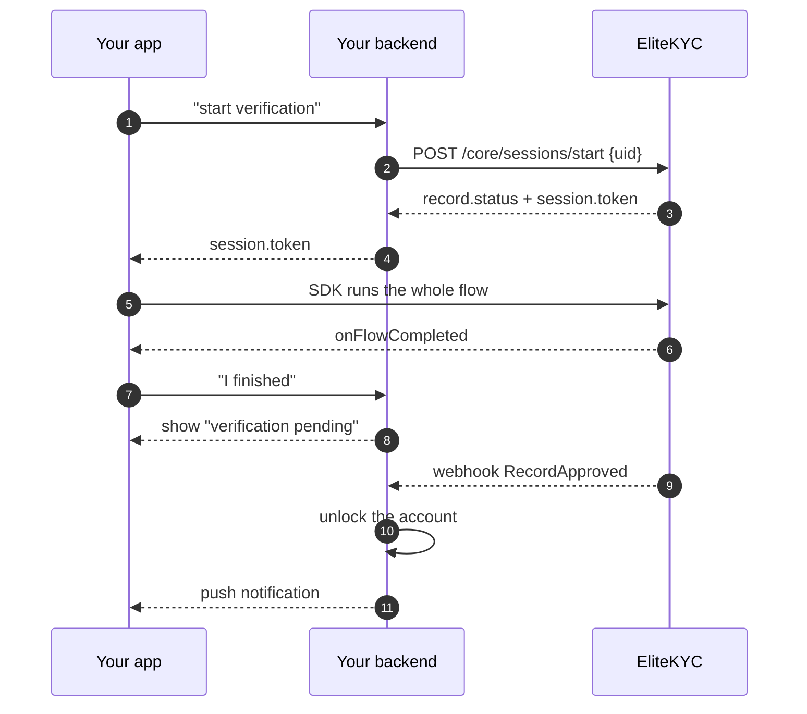

# Quickstart

Credentials to a verified test user. Two calls on your backend, one in your
app.

!!! info "You need a tenant first"
    Email [support@elitesoft.iq](mailto:support@elitesoft.iq) and ask for demo
    credentials. You get an API key, an API secret, and a base URL, typically
    `https://ekyc.demo.elitesoft.iq`. Your tenant arrives with document types,
    form schemas and check thresholds already configured, so the flow works
    from the first call.

## 1. Start a session

From your backend, never from the app. `uid` is your own stable identifier for
the customer: a user id, an account number, anything alphanumeric with dashes
or underscores, up to 50 characters.

=== "curl"

    ```bash
    curl -X POST https://ekyc.demo.elitesoft.iq/api/core/sessions/start \
      -H "Authorization: Basic $(printf '%s:%s' "$API_KEY" "$API_SECRET" | base64)" \
      -H "Content-Type: application/json" \
      -d '{"uid": "customer-001"}'
    ```

=== "C#"

    ```csharp
    var creds = Convert.ToBase64String(
        Encoding.UTF8.GetBytes($"{apiKey}:{apiSecret}"));

    using var http = new HttpClient { BaseAddress = new Uri(baseUrl) };
    http.DefaultRequestHeaders.Authorization = new("Basic", creds);

    var response = await http.PostAsJsonAsync(
        "api/core/sessions/start",
        new { uid = "customer-001" });

    var session = await response.Content
        .ReadFromJsonAsync<StartSessionResponse>();
    ```

=== "Node"

    ```javascript
    const creds = Buffer
      .from(`${apiKey}:${apiSecret}`)
      .toString("base64");

    const res = await fetch(
      `${baseUrl}/api/core/sessions/start`,
      {
        method: "POST",
        headers: {
          Authorization: `Basic ${creds}`,
          "Content-Type": "application/json",
        },
        body: JSON.stringify({ uid: "customer-001" }),
      },
    );

    const session = await res.json();
    ```

=== "PHP"

    ```php
    $creds = base64_encode("{$apiKey}:{$apiSecret}");

    $response = Http::withHeaders([
        'Authorization' => "Basic {$creds}",
    ])->post("{$baseUrl}/api/core/sessions/start", [
        'uid' => 'customer-001',
    ]);

    $session = $response->json();
    ```

You get back the record and the session:

```json
{
  "record": {
    "id": "01H1W1DE6X9Z5YEP5Y8DHR3H7J",
    "status": 1
  },
  "session": {
    "id": "01H1W1DE7A2B3C4D5E6F7G8H9J",
    "token": "eyJhbGciOiJIUzI1NiIs...",
    "expires_at": "2026-08-26T12:30:00Z"
  }
}
```

Starting a session never fails for business reasons. It authenticates and hands
you a token, and if no record exists for that `uid` it creates a pending one.
`record.status` tells you where the customer stands. See
[the status table](overview/how-it-works.md#the-record-lifecycle).

## 2. Hand the token to your app

Return `session.token` to your client over your own authenticated channel.
Thirty-minute lifetime, one record, that customer only.

## 3. Launch the flow

Add the SDK:

```yaml title="pubspec.yaml"
dependencies:
  elite_kyc:
    git:
      url: https://github.com/elitesoftiq/elitekyc-sdk-flutter.git
```

Then one call:

```dart
import 'package:elite_kyc/elite_kyc.dart';

EliteKycSdk.startKyc(
  context: context,
  session: KycSession.withToken(tokenFromYourBackend),
  baseUrl: 'https://ekyc.demo.elitesoft.iq',
  initialLanguage: Language.english,
  onFlowCompleted: () {
    // The customer is done. The decision is not in yet.
    // Show a pending state and wait for the webhook.
  },
);
```

The SDK pushes its own navigation stack, runs welcome, conditions, documents,
information and liveness, and pops back to you when the customer finishes or
exits.

!!! warning "Android and iOS need two native changes before this runs"
    NFC reading requires `FlutterFragmentActivity` and a Material theme on
    Android, and both platforms need camera and location permission strings.
    Ten minutes of work, but the app crashes at the NFC step without it.

    [Install and configure](sdk/installation.md) has the exact snippets.

## 4. Receive the result

`onFlowCompleted` fires when the customer leaves the flow. It does not mean
they passed. Checks run in the background and the outcome arrives by webhook.

Add a subscription in the back office pointing at your endpoint, subscribed to
`RecordApproved`, `RecordRejected` and `RecordPendingUserUpdate`. You will get:

```json
{
  "record": {
    "record_id": "01H1W1DE6X9Z5YEP5Y8DHR3H7J",
    "user_id": "customer-001",
    "status": 4,
    "status_value": "Approved",
    "rejection_comment": null,
    "rejection_reason_name": null,
    "rejection_reason_description": null
  },
  "documents": [
    {
      "id": "01H1W1DF8K2M3N4P5Q6R7S8T9V",
      "document_type": "IQ_NATIONAL_CARD",
      "data": { "first_name": "John", "national_id": "9876543210" }
    }
  ],
  "webhook": {
    "event_type": "RecordApproved",
    "event_type_value": 10,
    "eventable_id": null
  }
}
```

Respond `2xx`. Anything else is retried with exponential backoff for up to 72
hours.

Full payloads and delivery semantics: [Webhooks](api/webhooks.md).

## A minimal but correct backend

The shape worth copying, because it gets the asynchronous part right.



Two rules that save rework later.

**Never treat `onFlowCompleted` as success.** It fires when the customer exits,
including when they exit early. The webhook is the decision.

**Check `record.status` before you launch the SDK.** An already-approved
customer should not be sent through verification again, and one in
`PendingUserUpdate` needs the document resubmission flow rather than the full
one. Both are covered in [Sessions and attempts](api/sessions.md).

## Where to go from here

<div class="grid cards" markdown>

-   [:octicons-arrow-right-24: **SDK in depth**](sdk/index.md)

    Native setup, theming, single-step flows, callbacks, troubleshooting.

-   [:octicons-arrow-right-24: **API reference**](api/index.md)

    All 25 endpoints, with request and response shapes.

-   [:octicons-arrow-right-24: **Webhooks**](api/webhooks.md)

    Every event, every payload, retry and delivery semantics.

-   [:octicons-arrow-right-24: **Back office**](portal/index.md)

    What your compliance team does with the records you send.

</div>
