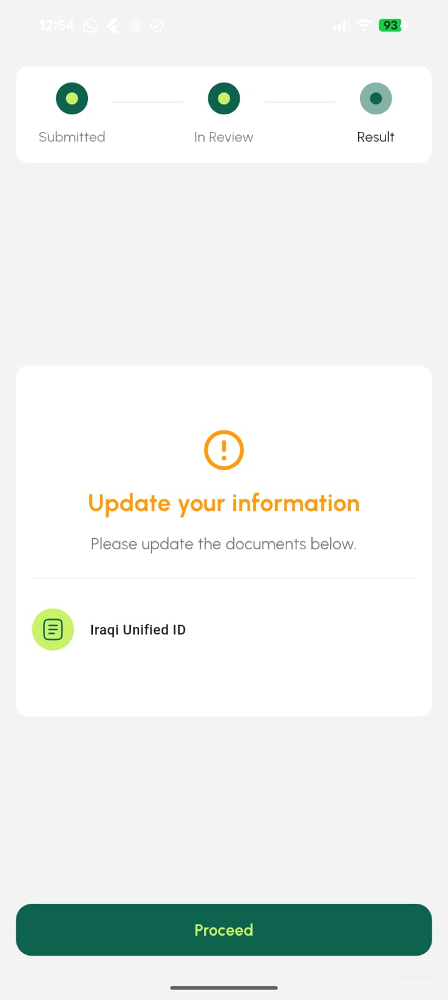
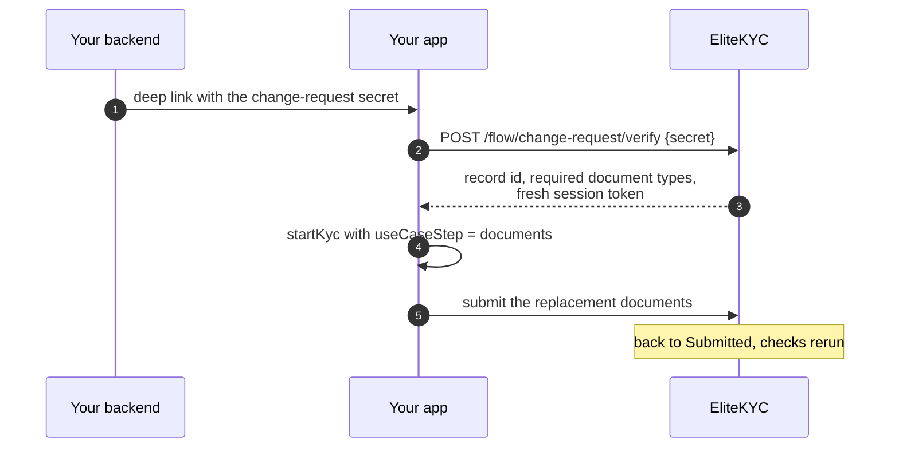

# Advanced use

Things past the standard flow. Skip this page on a first integration.

## Launching a single step

`useCaseStep` runs one step instead of the whole journey. Useful when you have
already collected something, or when you need to send a customer back for one
specific thing.

```dart
EliteKycSdk.startKyc(
  context: context,
  session: session,
  baseUrl: baseUrl,
  useCaseStep: KycStep(
    stepType: StepType.documents,
    data: [documentResponse],
    onSubmit: (result) => Future.value(),
  ),
  onStepSubmitted: (result, finishFlow) {
    handleScannedDocument(result);
    finishFlow();
  },
);
```

| Step type | What it runs |
|-----------|--------------|
| `StepType.welcome` | Introduction and permission priming |
| `StepType.conditions` | The conditions form |
| `StepType.documents` | Document capture and upload |
| `StepType.information` | The dynamic information form |
| `StepType.liveness` | Face liveness |
| `StepType.complete` | Completion screen |

The step still talks to the API, so the session token has to be valid and the
record has to be in a state where that step makes sense. Launching
`StepType.liveness` on a record that has not submitted documents returns
`Kyc.StepPrerequisiteNotMet`.

## Intercepting a step

`onStepSubmitted` fires when a step submits, hands you the payload, and gives
you a callback that lets the flow continue.

```dart
onStepSubmitted: (data, finishFlow) {
  analytics.track('kyc_step_submitted', {'payload': data});
  finishFlow();   // (1)!
}
```

1.  The flow is paused until you call this. Forget it and the customer sits on
    a spinner. Call it in a `finally` if the work in between can throw.

Use it for analytics, or to mirror step data into your own system as the
customer progresses. It is not a validation hook. You cannot reject a
submission from here.

## Document resubmission

When a reviewer rejects specific documents, the record moves to
`PendingUserUpdate` and your backend gets a
[`RecordPendingUserUpdate`](../api/webhooks.md#recordpendinguserupdate) webhook
listing exactly which documents failed and why.

The customer resubmits only those.

<div class="ek-phones" markdown>

<figure markdown>

<figcaption>What the customer sees. Only the rejected document is listed.</figcaption>
</figure>

</div>



The secret comes from the webhook. Verifying it returns a session token scoped
to that change request, so the customer cannot use the link to reopen anything
else. See [Flow and schemas](../api/flow.md#verify-a-document-change-request).

## Standalone liveness

Face liveness on its own, outside the flow.

```dart
import 'package:elite_kyc/src/presentation/widgets/liveness/liveness_instruction.dart';

final result = await Navigator.push(
  context,
  MaterialPageRoute(
    builder: (context) => FaceCaptureInstruction(
      accessToken: sessionToken,
      autoStart: true,
      onSubmit: () {
        // Liveness succeeded.
      },
    ),
  ),
);

// result is a JSON string:
// {"verified": true, "videoPath": "/path/to/video"}
```

!!! warning "This import reaches into `src/`"
    `FaceCaptureInstruction` is not part of the public export surface, so it
    can move or change signature in a minor release without that counting as a
    breaking change. If you depend on it, pin the SDK version and tell us, so
    we can promote it properly rather than break you quietly.

## Geolocation

Off by default. When your tenant has it enabled, the SDK asks for a location
during the flow, and the API rejects the attempt with `Kyc.GeolocationRequired`
if none arrives.

```dart
getCurrentLocation: () async {
  final permission = await Geolocator.checkPermission();
  if (permission == LocationPermission.denied) {
    if (await Geolocator.requestPermission() == LocationPermission.denied) {
      return null;
    }
  }

  final position = await Geolocator.getCurrentPosition();
  return GeolocationPayload(
    latitude: position.latitude,
    longitude: position.longitude,
  );
}
```

The callback is only invoked when the backend actually asks, not eagerly at
launch. You can ship it unconditionally and it costs nothing on tenants that do
not use it.

Returning `null` is a legitimate answer, and it fails the attempt. That is the
intended behaviour: on a tenant where location is required, an unlocatable
customer cannot be verified.

## Inspecting network traffic

The SDK's Dio client accepts your interceptors, which makes the whole flow
visible to whatever inspector you already use.

```dart
EliteKycSdk.startKyc(
  context: context,
  session: session,
  baseUrl: baseUrl,
  interceptors: [
    if (kDebugMode) alice.getDioInterceptor(),
  ],
  debugBuilder: (context, child) => DeveloperTools(child: child!),
);
```

Guard it with `kDebugMode`. Requests in this flow carry document images,
selfies and the session token.

## Web

The SDK builds for web with two gaps.

| Feature | Web |
|---------|-----|
| Document capture and upload | Works |
| Dynamic forms | Works |
| Azure Face liveness | Works |
| Innovatrics liveness | Not available |
| NFC chip reading | Not available |

A tenant configured for Innovatrics has no liveness path on web. If web matters
to you, that decision has to be Azure.

---

Next: [Troubleshooting](troubleshooting.md).
