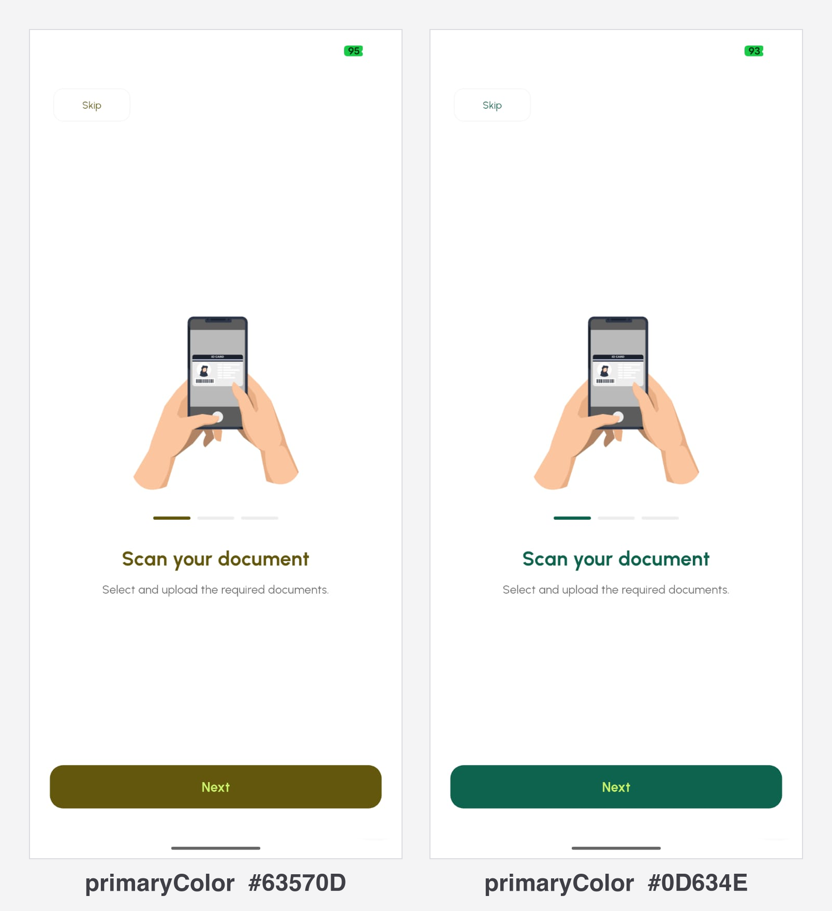
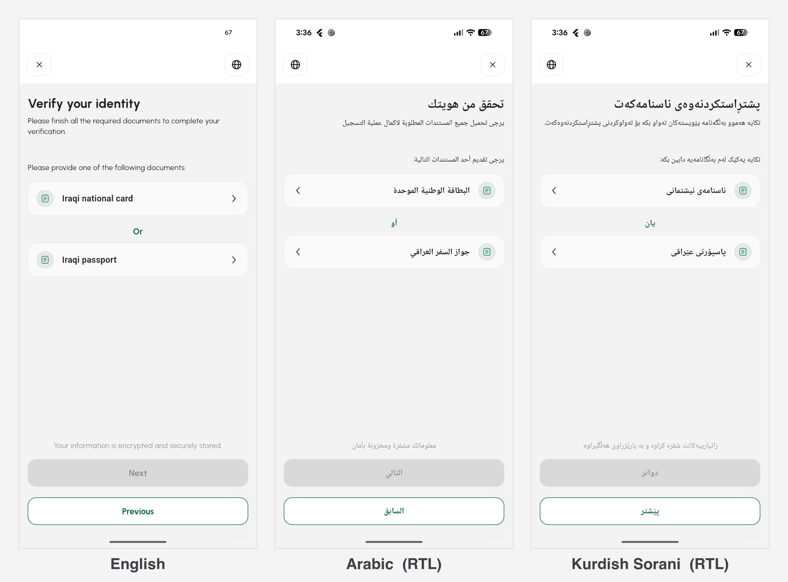

# Branding and language

The flow should look like part of your app, not like a third party bolted onto
it. Nothing in the SDK's UI mentions EliteKYC to your customer.

## Colours

Three colours, all optional. Pass them from your existing theme and the SDK
stays in sync when you rebrand.

```dart
EliteKycSdk.startKyc(
  context: context,
  session: session,
  baseUrl: baseUrl,
  primaryColor: Theme.of(context).colorScheme.primary,
  onPrimaryColor: Theme.of(context).colorScheme.onPrimary,
  secondaryColor: Theme.of(context).colorScheme.secondary,
);
```

| Parameter | Used for |
|-----------|----------|
| `primaryColor` | Buttons, progress, active states, capture guides |
| `onPrimaryColor` | Text and icons sitting on `primaryColor` |
| `secondaryColor` | Accents and secondary emphasis |

Set `onPrimaryColor` deliberately. The SDK does not compute contrast for you,
so a dark `primaryColor` with a dark `onPrimaryColor` gives you unreadable
buttons and no warning.

<figure class="ek-wide" markdown>

<figcaption>One screen, two tenants. Only the three colour parameters differ.</figcaption>
</figure>

!!! note "Native screens follow the Android theme, not these colours"
    The NFC reader is a native Android Fragment, so its text and background
    come from your Activity's `NormalTheme` rather than from `primaryColor`.
    Set that theme's colours to match. See
    [Install and configure](installation.md#mainactivity-and-theme).

## Language

```dart
initialLanguage: Language.english   // or .arabic, .kurdishSorani
```

Defaults to `Language.arabic`. Arabic and Kurdish Sorani switch the whole flow
to right-to-left, including capture guides and progress indicators.

The customer can change language inside the flow. `initialLanguage` sets the
starting point, so pass whatever your app is already showing:

```dart
initialLanguage: switch (Localizations.localeOf(context).languageCode) {
  'ar' => Language.arabic,
  'ckb' => Language.kurdishSorani,
  _ => Language.english,
},
```

<figure class="ek-wide" markdown>

<figcaption>Arabic and Kurdish mirror the whole layout, including the back chevrons and the icon side.</figcaption>
</figure>

Native strings in the Innovatrics screens are translated to Arabic and follow
the same setting. Nothing to configure.

## Tuning the scanner

The document camera scores every frame and refuses to capture a bad one. The
defaults are tuned for handheld capture in ordinary indoor light, and most
integrations never touch them.

```dart
const scannerConfig = ScannerConfig(
  blurVarianceThreshold: 20.0,
  glareWarnFraction: 0.06,
  lowLightLuminanceThreshold: 60.0,
  detectionCountBeforeCapture: 4,
);

EliteKycSdk.startKyc(
  context: context,
  session: session,
  baseUrl: baseUrl,
  scannerConfig: scannerConfig,
);
```

| Parameter | Default | Meaning | Raise it when | Lower it when |
|-----------|:-------:|---------|---------------|---------------|
| `blurVarianceThreshold` | `20.0` | Laplacian variance below which a frame is rejected as blurry | OCR quality matters more than capture speed | Users on older phones cannot get past the camera |
| `glareWarnFraction` | `0.06` | Fraction of pixels bright enough to count as glare | Glare warnings fire constantly on laminated cards | Glared photos are reaching OCR |
| `lowLightLuminanceThreshold` | `60.0` | Mean luminance, 0 to 255, below which low light is flagged | Dark captures are failing checks | Users in normal indoor light are being blocked |
| `detectionCountBeforeCapture` | `4` | Consecutive stable frames required before auto-capture | Captures fire while the card is still moving | Capture feels sluggish |

There is a real trade-off here, and it is worth naming: stricter thresholds
mean better OCR and fewer manual reviews, and also more customers giving up at
the camera. If you are going to move these numbers, move them once you have
data on where people actually drop off.

## Fitting the flow into your navigation

`startKyc` pushes a route onto the navigator you hand it and runs its own
`auto_route` stack inside. Your routes, your state and your deep links are
unaffected, and the SDK pops itself on exit.

Two things to get right.

**Use a `context` that survives the flow.** The flow lives for minutes. A
context from a widget that may be disposed, such as a dialog or a list item,
leaves you unable to navigate on completion. Use the screen's context and check
`mounted` before navigating in `onFlowCompleted`.

**Wrap the flow if you overlay debug tools.** `debugBuilder` wraps the SDK's
root `MaterialApp`, so an overlay that exists in your app can exist inside the
flow too.

```dart
debugBuilder: (context, child) => DeveloperTools(child: child!),
```

---

Next: [Advanced use](advanced.md).
