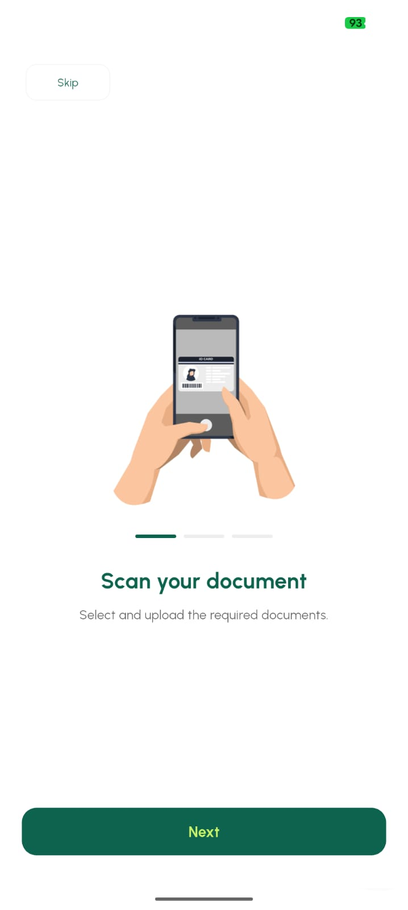
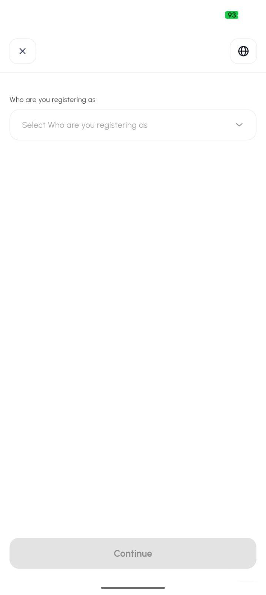
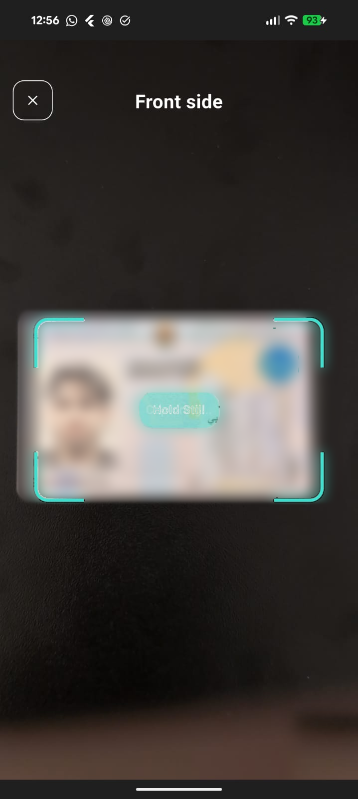
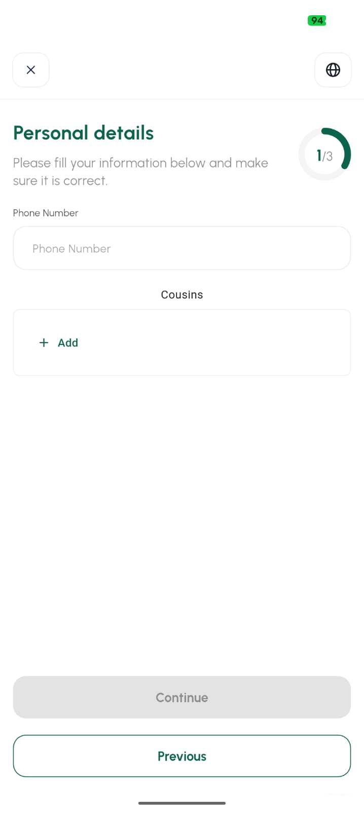
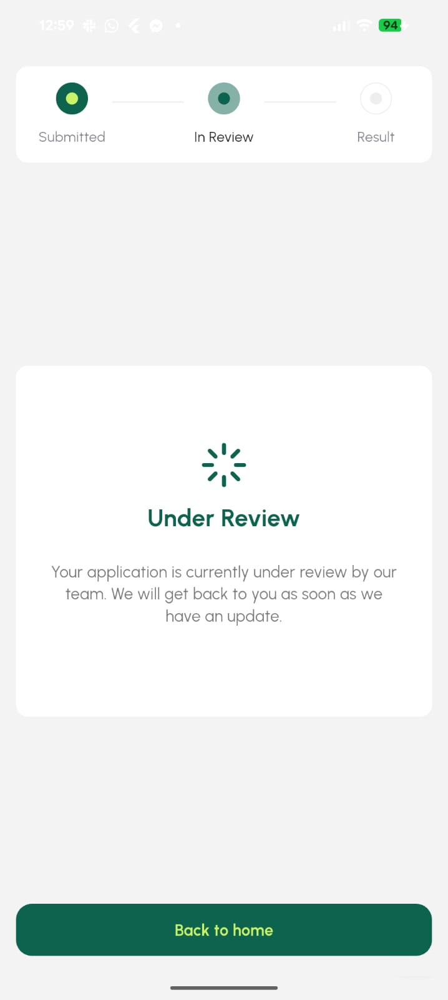

# Mobile SDK

A Flutter package that renders the entire verification journey. One call
launches it, one callback tells you the customer left.

```dart
EliteKycSdk.startKyc(
  context: context,
  session: KycSession.withToken(token),
  baseUrl: 'https://ekyc.demo.elitesoft.iq',
  onFlowCompleted: () => Navigator.pushNamed(context, '/pending'),
);
```

## What you get

The SDK pushes its own navigation stack onto yours and takes over until the
customer finishes or backs out. Inside that stack it handles:

- **Guided document capture.** Live edge detection, and blur, glare and
  low-light rejection before a frame is ever uploaded. The thresholds are
  tunable.
- **NFC chip reading.** On Android and iOS, for documents that carry a chip.
  Data signed by the issuing authority beats characters guessed from a photo.
- **Face liveness.** Azure Face or Innovatrics, whichever your tenant is set
  to. The SDK reads the setting at launch and picks the right path, including
  initialising the Innovatrics licence.
- **Dynamic forms.** Conditions and information forms rendered from your
  backend's schema, with validation and conditional visibility, and fields
  prefilled from what the documents said.
- **Three languages with correct direction.** English, Arabic, Kurdish Sorani,
  with right-to-left layout handled rather than approximated.
- **Your branding.** Primary, on-primary and secondary colours.

## The screens

<div class="ek-phones" markdown>

<figure markdown>

<figcaption>Welcome. Three slides, skippable.</figcaption>
</figure>

<figure markdown>

<figcaption>Conditions. The answers pick the documents.</figcaption>
</figure>

<figure markdown>

<figcaption>Capture. Edge detection, and no upload until the frame is good.</figcaption>
</figure>

<figure markdown>

<figcaption>Information. Rendered from your schema.</figcaption>
</figure>

<figure markdown>

<figcaption>Liveness. Live distance and framing feedback.</figcaption>
</figure>

<figure markdown>

<figcaption>Done. Checks run after the customer leaves.</figcaption>
</figure>

</div>

The document and selfie above are blurred here, not in the product.

## Platform support

| Platform | Support | What is missing |
|----------|---------|-----------------|
| Android | Full | Nothing. Innovatrics, Azure, NFC. |
| iOS | Full | NFC support depends on the document and the device. |
| Web | Partial | Azure liveness only. No Innovatrics, no NFC. |

Requires Flutter 3.24 or later and Dart 3.5 or later.

## What it does not do

- It does not tell you whether the customer passed. `onFlowCompleted` fires on
  exit, successful or not. The decision reaches your backend by webhook.
- It does not manage your session token. Your backend mints it and hands it
  over.
- It does not render as an embedded widget. It takes a full navigation stack.

## Pages in this section

<div class="grid cards" markdown>

-   [:octicons-arrow-right-24: **Install and configure**](installation.md)

    Dependency, Android and iOS native setup, permissions, Azure credentials.
    Do this first: two of these steps are crash-on-launch if skipped.

-   [:octicons-arrow-right-24: **Launching the flow**](usage.md)

    `startKyc` in full, every parameter, and the two session modes.

-   [:octicons-arrow-right-24: **Branding and language**](customization.md)

    Colours, languages, scanner tuning.

-   [:octicons-arrow-right-24: **Advanced use**](advanced.md)

    Single-step launches, standalone widgets, document resubmission,
    geolocation, network inspection.

-   [:octicons-arrow-right-24: **Troubleshooting**](troubleshooting.md)

    The failures that actually happen, and what causes them.

</div>
