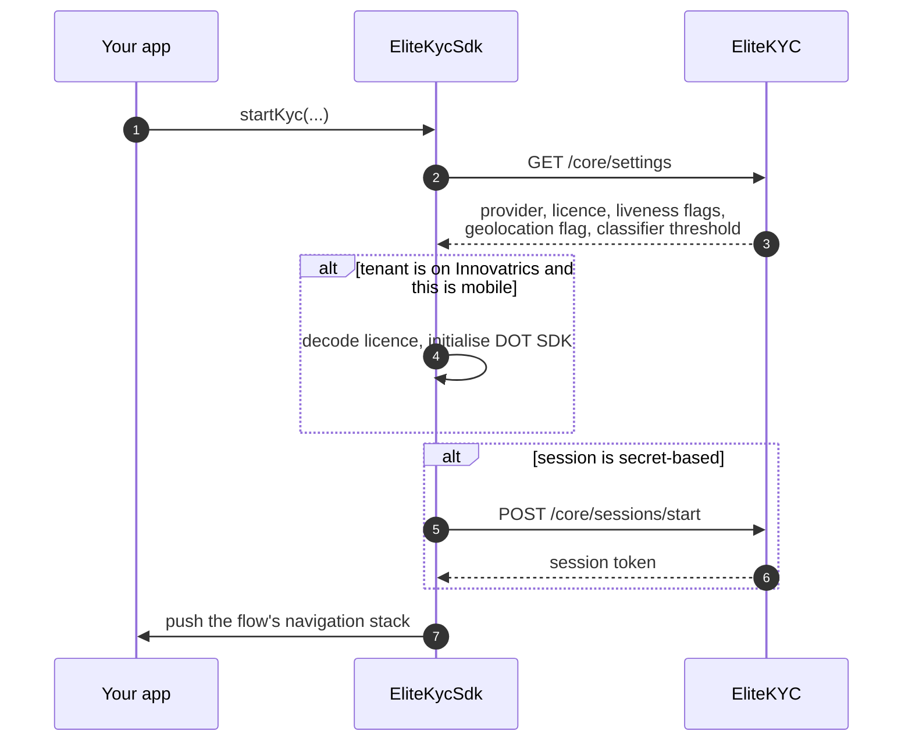

# Launching the flow

One call. Everything else on this page is a parameter to it.

```dart
import 'package:elite_kyc/elite_kyc.dart';

EliteKycSdk.startKyc(
  context: context,
  session: KycSession.withToken(tokenFromYourBackend),
  baseUrl: 'https://ekyc.demo.elitesoft.iq',
  initialLanguage: Language.english,
  primaryColor: const Color(0xFF0D634E),
  onFlowCompleted: () {
    Navigator.of(context).pushNamed('/verification-pending');
  },
);
```

`startKyc` pushes a `MaterialPageRoute` onto your navigator and runs an
isolated navigation stack inside it. Your routes are untouched, and the SDK
pops itself when the flow ends.

## Parameters

| Parameter | Type | Required | Notes |
|-----------|------|:--------:|-------|
| `context` | `BuildContext` | yes | Used to push the flow. Must be mounted. |
| `session` | `KycSession` | yes | See [session modes](#session-modes). |
| `baseUrl` | `String` | yes | Environment root, no trailing slash. |
| `initialLanguage` | `Language` | no | `english`, `arabic`, `kurdishSorani`. Defaults to `arabic`. |
| `primaryColor` | `Color?` | no | Brand primary. |
| `onPrimaryColor` | `Color?` | no | Foreground on primary. |
| `secondaryColor` | `Color?` | no | Accent. |
| `scannerConfig` | `ScannerConfig?` | no | Capture-quality thresholds. See [Branding and language](customization.md#tuning-the-scanner). |
| `onFlowCompleted` | `VoidCallback?` | no | Fires when the customer leaves the flow, for any reason. |
| `onStepSubmitted` | `void Function(dynamic, VoidCallback)?` | no | Intercepts a step submission. See [Advanced use](advanced.md#intercepting-a-step). |
| `useCaseStep` | `KycStep?` | no | Launch one step instead of the whole flow. See [Advanced use](advanced.md#launching-a-single-step). |
| `getCurrentLocation` | `Future<GeolocationPayload?> Function()?` | no | Supplies location when your tenant requires it. |
| `interceptors` | `List<Interceptor>?` | no | Dio interceptors on the SDK's HTTP client. |
| `debugBuilder` | `TransitionBuilder?` | no | Wraps the SDK's root `MaterialApp`, for debug overlays. |

`baseUrl` is typed as nullable but is dereferenced during startup. Pass it.

## Session modes

### With a token, for production

Your backend calls `POST /core/sessions/start` and gives you the token.

```dart
session: KycSession.withToken(tokenFromYourBackend)
```

You control the `uid`, so the record maps onto your user. You see
`record.status` before launching, so you can skip verification for someone
already approved. The token is worth one record for thirty minutes.

### With a secret, for demos only

```dart
session: KycSession.withSecret('YOUR_CLIENT_SECRET')
```

The SDK starts the session itself. Convenient, and wrong for production.

!!! danger "The secret in an app binary is a secret you have published"
    It authenticates as your entire tenant. Anyone who unpacks your APK can
    start sessions, read records and push data as you. Mobile binaries are not
    a place secrets can hide.

    Use `withToken` in anything you ship. This mode exists so a proof of
    concept can be wired up before your backend work starts.

## What the SDK does at startup

Worth knowing, because it explains the first-launch latency and a couple of
failure modes.



Two consequences.

**Tenant settings decide the liveness path, not your code.** The SDK reads
which provider your tenant uses and takes the right branch. Switching provider
is a back-office change, and your app does not ship a new build for it.

**If startup fails, the flow never opens.** A network failure while fetching
settings, or a failed secret-based session start, calls `onFlowCompleted` and
returns. Handle `onFlowCompleted` as "the flow ended", not "the flow ran".

## Handling completion

```dart
onFlowCompleted: () async {
  final status = await myBackend.getVerificationStatus();
  if (status == 'approved') {
    context.go('/home');
  } else {
    context.go('/verification-pending');
  }
}
```

!!! warning "Completion is not approval"
    `onFlowCompleted` fires when the customer completes the flow, when they
    back out halfway, and when startup fails. It carries no result.

    The real outcome arrives at your backend as a
    [webhook](../api/webhooks.md). Ask your own backend what the status is, or
    show a pending state and push a notification when the webhook lands.

## Checking status before you launch

`POST /core/sessions/start` returns `record.status`. Branch on it rather than
launching blindly.

```dart
switch (record.status) {
  case 4: // Approved
    // Already verified. Do not send them through again.
    return;

  case 8: // PendingUserUpdate
    // Specific documents were rejected. Use the change-request flow
    // rather than the full journey.
    return startDocumentResubmission();

  case 5: // Rejected
    // Only offer a retry if your tenant allows resubmission.
    // GET /core/settings exposes allow_resubmission.
    break;

  default:
    EliteKycSdk.startKyc(/* ... */);
}
```

Status values are listed in
[the record lifecycle](../overview/how-it-works.md#the-record-lifecycle).

## A complete example

```dart
import 'package:elite_kyc/elite_kyc.dart';
import 'package:flutter/material.dart';

class VerificationScreen extends StatefulWidget {
  const VerificationScreen({super.key});

  @override
  State<VerificationScreen> createState() => _VerificationScreenState();
}

class _VerificationScreenState extends State<VerificationScreen> {
  bool _starting = false;

  Future<void> _start() async {
    setState(() => _starting = true);

    try {
      // Your backend calls POST /core/sessions/start and returns the token.
      final session = await myApi.startKycSession();

      if (session.recordStatus == 4) {
        if (mounted) context.go('/home');
        return;
      }

      if (!mounted) return;

      EliteKycSdk.startKyc(
        context: context,
        session: KycSession.withToken(session.token),
        baseUrl: const String.fromEnvironment('KYC_BASE_URL'),
        initialLanguage: Localizations.localeOf(context).languageCode == 'ar'
            ? Language.arabic
            : Language.english,
        primaryColor: Theme.of(context).colorScheme.primary,
        onPrimaryColor: Theme.of(context).colorScheme.onPrimary,
        getCurrentLocation: _location,
        onFlowCompleted: () {
          if (mounted) context.go('/verification-pending');
        },
      );
    } finally {
      if (mounted) setState(() => _starting = false);
    }
  }

  Future<GeolocationPayload?> _location() async {
    final p = await Geolocator.getCurrentPosition();
    return GeolocationPayload(latitude: p.latitude, longitude: p.longitude);
  }

  @override
  Widget build(BuildContext context) => Scaffold(
        body: Center(
          child: FilledButton(
            onPressed: _starting ? null : _start,
            child: const Text('Verify my identity'),
          ),
        ),
      );
}
```

---

Next: [Branding and language](customization.md).
